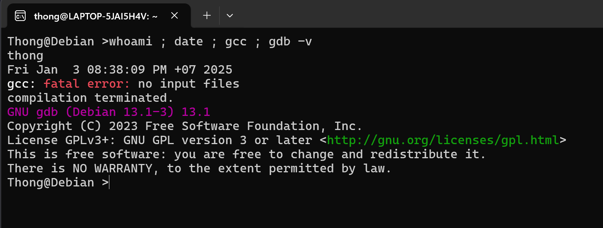

ชมวิดีโออธิบาย Activity นี้ได้ที่ https://youtu.be/dmT4HQisv3s

ผู้ที่ส่ง Activity สาย จะโดนหัก 1 คะแนน

ขั้นตอนการทำงาน

1. ติดตั้ง Linux เช่น Debian, Ubuntu ในเครื่องคอมพิวเตอร์ตนเอง

ถ้านิสิตใช้งาน Windows 10, 11 สามารถติดตั้ง WSL (Windows Subsytem for Linux)

ถ้านิสิตใช้ Windows รุ่นอื่นหรือใช้เครื่องแมค อาจต้องติดตั้ง VirtualBox ก่อน แล้วจึงค่อยติดตั้ง Linux ใน VirtualBox อีกครั้ง

2. ติดตั้ง gcc , gdb

ขอให้ติดตั้ง gcc (C compiler) และ gdb (GNU debugger) ด้วยคำสั่ง

sudo apt-get install gcc

sudo apt-get install gdb

3. การส่งงาน

พิมพ์คำสั่งต่อไปนี้ใน Linux คือ whoami ; date ; gcc ; gdb -v และ capture หน้าจอส่งมาเหมือนตัวอย่างข้างล่าง

