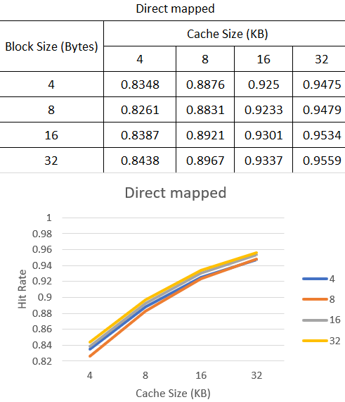
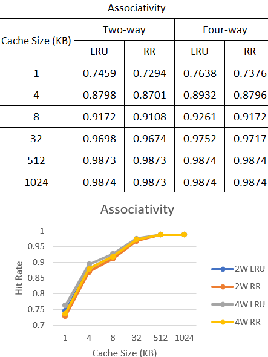

# Assignment II – Cache Design

## How to get the results

1. Write the Cache files (CacheSim.c, CacheSimSetAsso.)

2. Compile

```bash
gcc -o CacheSim CacheSim.c -lm
```

3. Run

```bash
# Cache size of 4 KB.
# Block size of 4 bytes.
./CacheSim gcc_ld_trace.txt 4 4
```

4. Repeat the steps 2, 3 for all cases

## a) Block Size Tradeoff on direct mapped cache

### Result



### Explanation

- Hit rate increases with both cache size and block size, but the rate of improvement slows down as size grows.
- Block size doesn’t always lead to better hit rates at the same cache size. For example, a block size of 4 gives a higher hit rate than 8 at certain cache sizes.
- At some point, like at 32KB, hit rates for different block sizes become almost the same, showing diminishing returns from increasing cache or block size further.
- The biggest improvement in hit rate happens when increasing cache size from small to medium (e.g., 4KB to 8KB), while larger cache sizes (like 16KB to 32KB) show smaller gains.
- Larger caches take more time to access, so we need to balance the benefits of bigger cache and block sizes. Overly large sizes can also lead to write penalties.

### Conclusion

Bigger cache and block sizes are better but only to a certain extent. It’s important not to go too big to avoid inefficiency.

## b) N-way associative cache with replacement algorithms: Least recently used (LRU), and Round Robin (RR).

### Result



### Explanation

- Hit rate increases with cache size, but the improvement slows down as the size grows. At some point, further increasing cache size or changing the replacement policy has little effect on hit rate, as seen at 1024KB.
- 4-way associative has a slightly better hit rate than 2-way with the same replacement policy.
- LRU performs better than RR, especially for small caches. However, as cache size increases, the difference between LRU and RR becomes less significant.
- For smaller caches, LRU is preferable for better performance, though it is more complex. For larger caches, RR is a simpler option with comparable performance to LRU.

### Conclusion

Use RR for small caches, LRU for larger caches, and 4-way associative for better hit rates overall.
