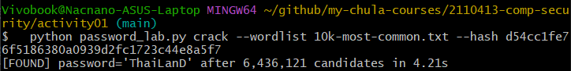
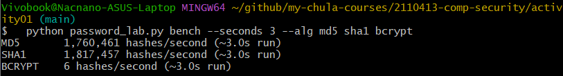
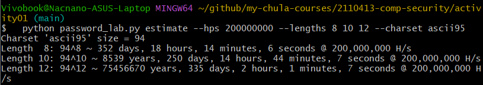

### ## Exercise 1: Cracking the SHA-1 Hash

The provided script successfully cracked the SHA-1 hash.

The password is **'ThaiLanD'**.

The script found this by testing words from a dictionary. It applied common variations like different capitalization and character substitutions (e.g., 'a' for '4'). This process is known as a dictionary attack.

---

### ## Exercise 2: Hashing Algorithm Performance

The goal was to measure how many hashes different algorithms can compute in a set time. The results show a major difference in speed.

- **MD5**: ~1.7 million hashes/second
- **SHA1**: ~1.8 million hashes/second
- **BCRYPT**: 6 hashes/second

This experiment shows why modern algorithms like **bcrypt** are more secure. They are intentionally slow. Fast algorithms like MD5 and SHA-1 allow attackers to guess billions of passwords very quickly.

---

### ## Exercise 3: Brute-Force Time Estimation

This exercise estimated the time to brute-force a password based on its length. The results assume an attacker can test 200 million hashes per second.

- **Length 8**: ~352 days
- **Length 10**: ~8,539 years
- **Length 12**: ~75.4 million years

This shows that **password length** is critical for security. A password should be long enough to take more than a year to crack. Based on these results, a password of at least **10 to 12 characters** is recommended.

---

### ## Question 4: Brute-Forcing Bcrypt

No, a brute-force attack on a **bcrypt** hash is **not practical**.

As seen in the benchmark, bcrypt is extremely slow. An attacker can only test a few passwords per second. This makes guessing every possible combination an impossibly long process.

---

### ## Question 5: Rainbow Table Attack on Bcrypt

No, a rainbow table attack is also **not practical** against bcrypt.

Bcrypt automatically incorporates a random value called a **salt** into each hash. This salt is different for every password. Therefore, an attacker cannot use a single pre-computed rainbow table. They would need a separate, massive table for every single user, which is not feasible.

---

### ## Question 6: Secure Password Storage Design

- **Use a Proper Hash Function**: Always use a modern, slow algorithm designed for passwords, such as **bcrypt**, scrypt, or Argon2. Avoid MD5 and SHA-1.
- **Use Salting**: A unique, random salt must be generated for each password and stored with the hash. This is a core feature of bcrypt and defends against rainbow table attacks.
- **Use a Cost Factor**: The "slowness" of bcrypt can be adjusted. You should configure this cost factor to be as high as your servers can handle without creating a bad user experience.
- **Secure the Database**: Protect the database itself with strong access controls and encryption. Even perfectly hashed passwords are at risk if the entire database is stolen.
