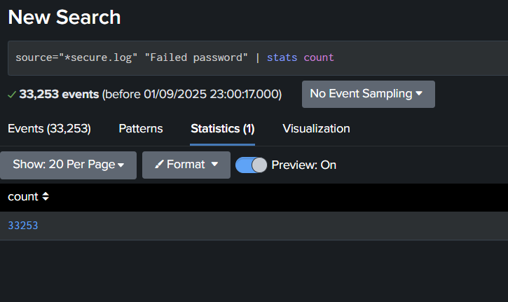
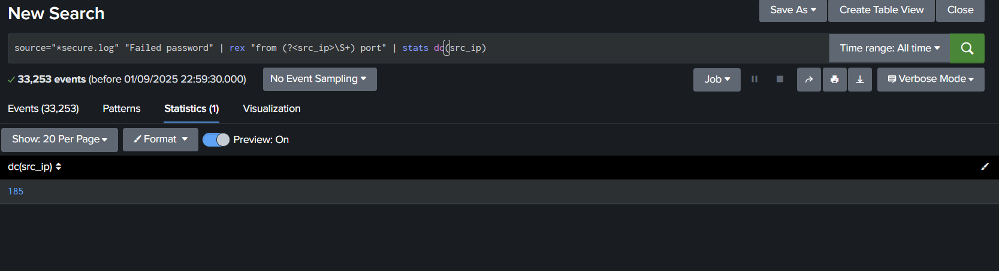
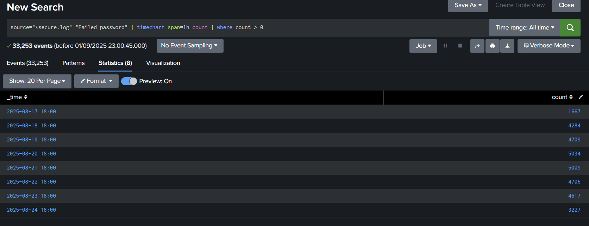
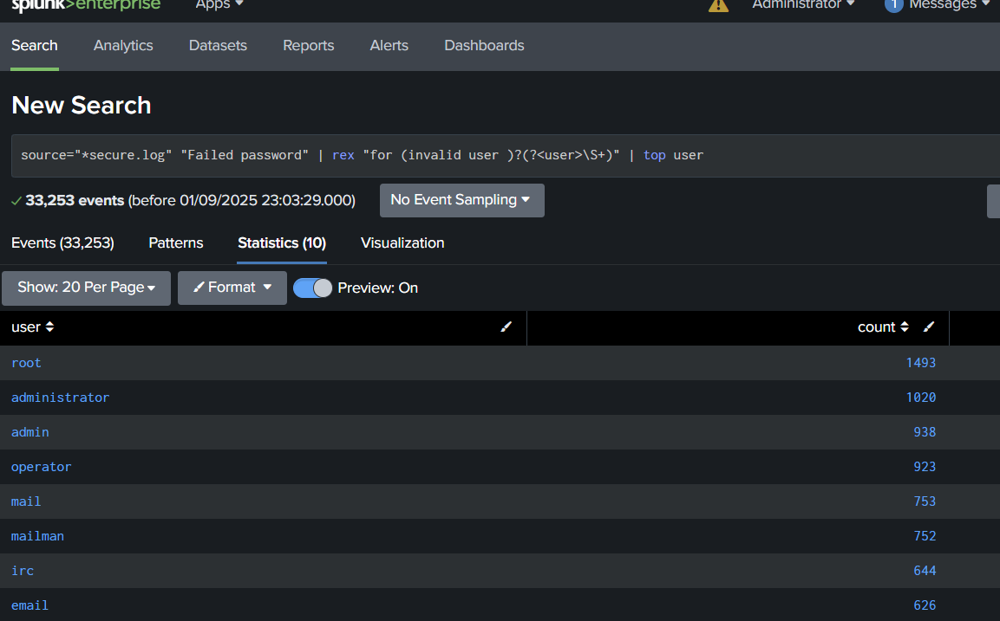
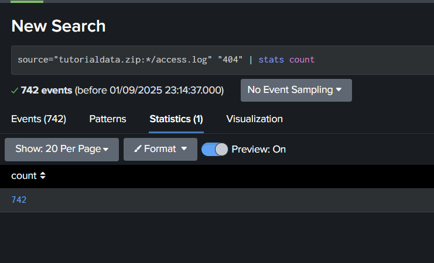
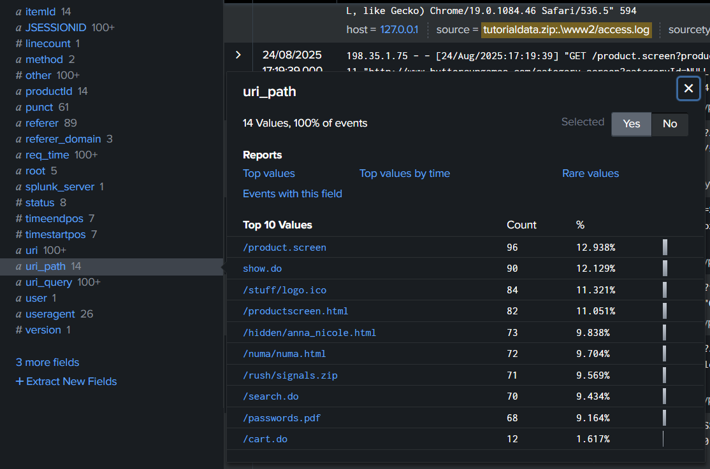
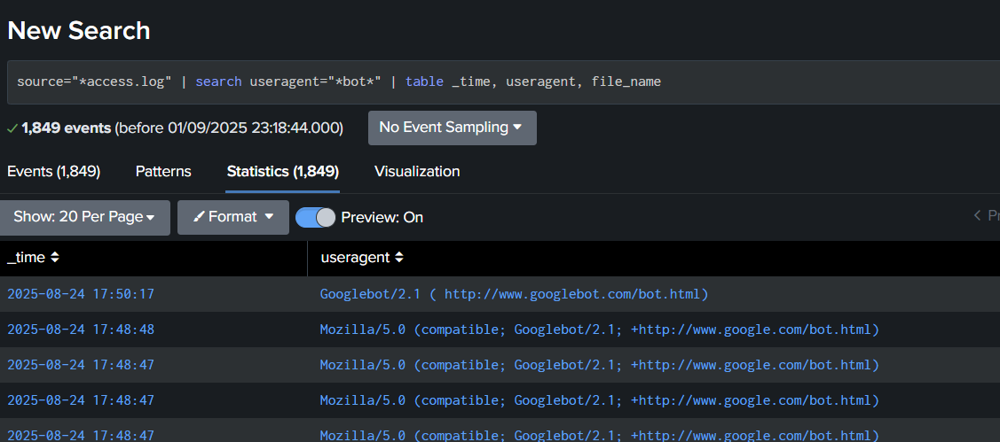

# Activity : Log Analysis

## Part I: Can you find people trying to break into the servers?

### Q1

How many hackers are trying to get access to our servers? And how many attempts are there? Explain/define how you count distinct hackers.

**Answer** 33253 Attempts, 185 Hackers

**Splunk Search Command:**

Attempts

```
source="*secure.log" "Failed password" | stats count
```



Unique Hackers

```
source="*secure.log" "Failed password" | rex "from (?<src_ip>\S+) port" | stats dc(src_ip)
```



### Q2

What time do hackers appear to try to hack our servers?

**Answer** 2025-08-17 to 2025-08-24 at 18:00

**Splunk Search Command:**

```
source="*secure.log" "Failed password" | timechart span=1h count | where count > 0
```



**Results:**
[Describe the time patterns you observe - peak hours, consistent timing, etc.]

### Q3

Which server (mailsv, www1, www2, www3) had the most attempts?

**Answer** www1

**Splunk Search Command:**

```
source="*secure.log" "Failed password" | stats count by source
```


### Q4

What is the most popular account that hackers use to try to break in?

**Answer** Root

**Splunk Search Command:**

```
source="*secure.log" "Failed password" | rex field=_raw "user (?<username>\w+)" | stats count by username | sort -count | head 20
```



---

## Part II: Sensitive Files on Web Servers

### Q5

Can you find attempts to get access to sensitive information from our web servers? How many attempts were there?

**Answer** 742 Attempts with 404 Status,

**Splunk Search Commands:**

Attempts

```
source="tutorialdata.zip:*/access.log" "404" | stats count
```



### Q6

What resource/file are hackers looking for?

**Answer** password.pdf, /hidden/anna_nicole.html

**Splunk Search Command:**

```
source="tutorialdata.zip:*/access.log" "404" | stats count
```

Sensitive Information (find using uri_path)


---

## Part III: Are there bots crawling our websites?

### Q7

Can you find any bots crawling our websites?

**Answer** Googlebot/2.1 ( http://www.googlebot.com/bot.html)

**Splunk Search Command:**

```
source="*access.log" | search useragent="*bot*" | table _time, useragent, file_name
```



### Q8

What are they doing on the site? (Hint: Look for User-Agent in the web access.logs.)

**Answer** Indexing for Google search

**Splunk Search Command:**

```
source="*access.log" useragent="*bot*" | stats count by uri_path, useragent | sort -count
```

---
