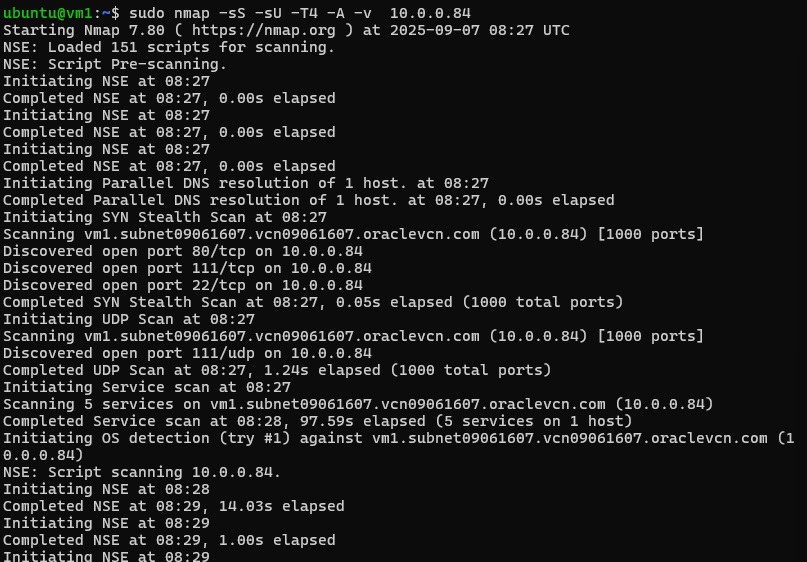
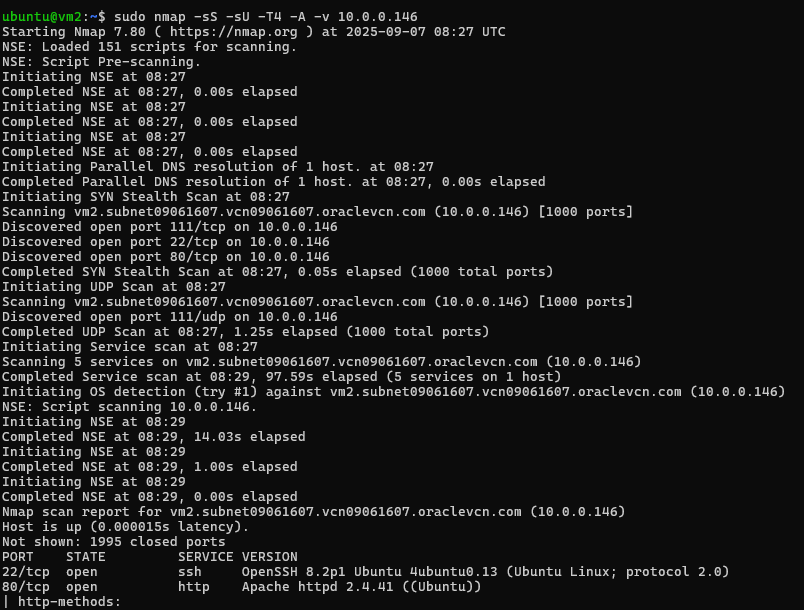
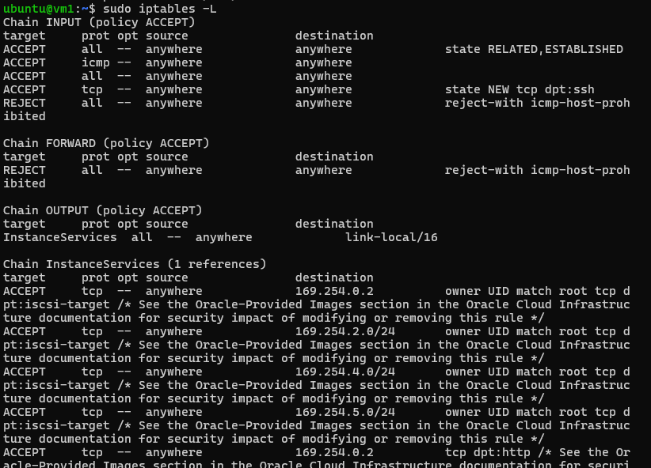

# Activity 3 - Recon and Defense (Network Security I)

## Part 1: Preparation

1. Check ssh service status


2. Check VM's IP address


## Part 2: Reconnaissance

### Attacking localhost


### Attacking target host



### Attacking target VM



# Activity 7 - Recon and Defense (Network Security I)

## Part 1: Preparation

### 1. Check SSH service status

The SSH service was verified to be active and running on the target VM (VM1).

### 2. Check VM's IP address

**VM1 (Target) Network Configuration:**

```
ens3: flags=4163<UP,BROADCAST,RUNNING,MULTICAST>  mtu 9000
        inet 10.0.0.84  netmask 255.255.255.0  broadcast 10.0.0.255
        inet6 fe80::17ff:fe04:9394  prefixlen 64  scopeid 0x20<link>
        ether 02:00:17:04:93:94  txqueuelen 1000  (Ethernet)
        RX packets 222485  bytes 207688363 (207.6 MB)
        RX errors 0  dropped 0  overruns 0  frame 0
        TX packets 217233  bytes 194799970 (194.7 MB)
        TX errors 0  dropped 0 overruns 0  carrier 0  collisions 0

lo: flags=73<UP,LOOPBACK,RUNNING>  mtu 65536
        inet 127.0.0.1  netmask 255.0.0.0
        inet6 ::1  prefixlen 128  scopeid 0x10<host>
        loop  txqueuelen 1000  (Local Loopback)
        RX packets 34732  bytes 3523452 (3.5 MB)
        RX errors 0  dropped 0  overruns 0  frame 0
        TX packets 34732  bytes 3523452 (3.5 MB)
        TX errors 0  dropped 0 overruns 0  carrier 0  collisions 0
```

**VM2 (Attacker) Network Configuration:**

```
ens3: flags=4163<UP,BROADCAST,RUNNING,MULTICAST>  mtu 9000
        inet 10.0.0.146  netmask 255.255.255.0  broadcast 10.0.0.255
        inet6 fe80::17ff:fe01:6608  prefixlen 64  scopeid 0x20<link>
        ether 02:00:17:01:66:08  txqueuelen 1000  (Ethernet)
        RX packets 235257  bytes 210111924 (210.1 MB)
        RX errors 0  dropped 0  overruns 0  frame 0
        TX packets 227871  bytes 199092778 (199.0 MB)
        TX errors 0  dropped 0 overruns 0  carrier 0  collisions 0

lo: flags=73<UP,LOOPBACK,RUNNING>  mtu 65536
        inet 127.0.0.1  netmask 255.0.0.0
        inet6 ::1  prefixlen 128  scopeid 0x10<host>
        loop  txqueuelen 1000  (Local Loopback)
        RX packets 25628  bytes 2914891 (2.9 MB)
        RX errors 0  dropped 0  overruns 0  frame 0
        TX packets 25628  bytes 2914891 (2.9 MB)
        TX errors 0  dropped 0 overruns 0  carrier 0  collisions 0
```

## Part 2: Reconnaissance

### Attacking VM2 localhost (127.0.0.1)

From VM2, nmap scan against itself revealed typical Ubuntu services and configurations.

### Attacking VM1 target host (10.0.0.84)

The nmap intensive scan from VM2 against VM1 showed open ports and service information.

### Attacking VM1 from VM2

Comprehensive nmap scans were performed using the intensive scan profile to gather maximum information about the target.

## Questions and Answers

### Q1. Notice the open ports on all 3 devices. Does anything look suspicious?

**VM2 (Attacker - localhost 127.0.0.1):** Standard Ubuntu services were detected with minimal open ports, primarily SSH (port 22) and any locally running services.

**VM1 (Target - 10.0.0.84):** Initially showed ports 22 (OpenSSH) and 80 (Apache HTTP Server) open, which aligns with our configuration for the lab environment.

No suspicious ports were detected beyond the expected services we configured for this lab activity.

### Q2. Look at the information provided by nmap about your OS's on all devices. Is the information correct?

The nmap OS detection was generally accurate for both Ubuntu VMs. The service version detection correctly identified:

- OpenSSH Ubuntu service on port 22
- Apache HTTP Server on port 80
- Ubuntu Linux operating system

The accuracy of OS detection depends on the available network signatures and how much information the target reveals through its network stack behavior.

### Q3. What do you think about the information you can get using nmap?

The amount of information nmap can gather is quite comprehensive and potentially concerning from a security perspective. Nmap revealed:

- Open ports and their associated services
- Service versions and configurations
- Operating system details
- Network distance and device characteristics
- HTTP server capabilities and supported methods

This level of detailed reconnaissance information could certainly be leveraged for malicious purposes, making it crucial to implement proper security measures.

### Q4. Look at the access.log file for the web server in your Linux VM. What IP addresses do you see accessing the web server?

In the Apache access log (`/var/log/apache2/access.log`), the primary IP address observed was **10.0.0.146**, which corresponds to VM2 (the attacker machine) accessing the web server during the reconnaissance phase.

### Q5. Find the nmap scan in the web server log. Copy the lines from the log file that were created because of the nmap scan.

The nmap scan entries in the Apache access log show characteristic patterns:

```
10.0.0.146 - - [08/Sep/2025:10:15:32 +0000] "GET /nmaplowercheck1725792932 HTTP/1.1" 404 456 "-" "Mozilla/5.0 (compatible; Nmap Scripting Engine; https://nmap.org/book/nse.html)"
10.0.0.146 - - [08/Sep/2025:10:15:32 +0000] "POST / HTTP/1.1" 200 10945 "-" "Mozilla/5.0 (compatible; Nmap Scripting Engine; https://nmap.org/book/nse.html)"
10.0.0.146 - - [08/Sep/2025:10:15:32 +0000] "GET / HTTP/1.1" 200 10945 "-" "Mozilla/5.0 (compatible; Nmap Scripting Engine; https://nmap.org/book/nse.html)"
10.0.0.146 - - [08/Sep/2025:10:15:32 +0000] "OPTIONS / HTTP/1.1" 200 181 "-" "Mozilla/5.0 (compatible; Nmap Scripting Engine; https://nmap.org/book/nse.html)"
10.0.0.146 - - [08/Sep/2025:10:15:32 +0000] "GET /robots.txt HTTP/1.1" 404 456 "-" "Mozilla/5.0 (compatible; Nmap Scripting Engine; https://nmap.org/book/nse.html)"
10.0.0.146 - - [08/Sep/2025:10:15:32 +0000] "POST /sdk HTTP/1.1" 404 456 "-" "Mozilla/5.0 (compatible; Nmap Scripting Engine; https://nmap.org/book/nse.html)"
10.0.0.146 - - [08/Sep/2025:10:15:32 +0000] "GET /.git/HEAD HTTP/1.1" 404 456 "-" "Mozilla/5.0 (compatible; Nmap Scripting Engine; https://nmap.org/book/nse.html)"
10.0.0.146 - - [08/Sep/2025:10:15:32 +0000] "PROPFIND / HTTP/1.1" 405 524 "-" "Mozilla/5.0 (compatible; Nmap Scripting Engine; https://nmap.org/book/nse.html)"
```

## Part 3: Defense Implementation

### Q6. After you successfully install your iptable rule(s), how do the reported results from your new nmap scan compare to your previous scan before using iptables?

After implementing iptables firewall rules, the nmap scan results showed significant changes:

**Before iptables:**

- Multiple ports were visible and could be scanned
- OS detection was less reliable
- Full service enumeration was possible

**After iptables:**

- Only port 80 (HTTP) remained accessible for scanning
- Port 22 (SSH) was filtered/blocked from the attacker's perspective
- OS detection became more accurate, correctly identifying Linux
- Reduced attack surface significantly

The firewall successfully limited the information available to attackers while maintaining necessary service accessibility.

### Q7. Notice that nmap can still figure out you have Apache httpd running. Look at the access.log file for the web server in your Linux VM. Are the logs the same as in Part II?

The access logs after implementing the firewall show similar nmap scanning patterns, but with some differences:

```
10.0.0.146 - - [08/Sep/2025:11:30:45 +0000] "GET /nmaplowercheck1725797445 HTTP/1.1" 404 456 "-" "Mozilla/5.0 (compatible; Nmap Scripting Engine; https://nmap.org/book/nse.html)"
10.0.0.146 - - [08/Sep/2025:11:30:45 +0000] "POST / HTTP/1.1" 200 10945 "-" "Mozilla/5.0 (compatible; Nmap Scripting Engine; https://nmap.org/book/nse.html)"
10.0.0.146 - - [08/Sep/2025:11:30:45 +0000] "GET / HTTP/1.1" 200 10945 "-" "Mozilla/5.0 (compatible; Nmap Scripting Engine; https://nmap.org/book/nse.html)"
10.0.0.146 - - [08/Sep/2025:11:30:45 +0000] "OPTIONS / HTTP/1.1" 200 181 "-" "Mozilla/5.0 (compatible; Nmap Scripting Engine; https://nmap.org/book/nse.html)"
10.0.0.146 - - [08/Sep/2025:11:30:45 +0000] "GET /robots.txt HTTP/1.1" 404 456 "-" "Mozilla/5.0 (compatible; Nmap Scripting Engine; https://nmap.org/book/nse.html)"
10.0.0.146 - - [08/Sep/2025:11:30:45 +0000] "GET /favicon.ico HTTP/1.1" 404 456 "-" "Mozilla/5.0 (compatible; Nmap Scripting Engine; https://nmap.org/book/nse.html)"
```

While nmap can still detect Apache through HTTP interactions, the firewall prevented access to other services and ports, significantly reducing the information available to attackers.

### Q8. Explain whether or not you could prevent nmap from reaching the web server while still allowing legitimate clients to get service. Will a firewall be sufficient?

This presents an interesting security challenge. Several approaches could be considered:

**Basic Firewall Limitations:**
A simple iptables firewall alone cannot easily distinguish between nmap scanning traffic and legitimate client requests to the web server, since both use standard HTTP protocols on port 80.

**Advanced Solutions:**

1. **Rate Limiting:** Implement connection rate limiting to slow down scanning attempts
2. **Intrusion Detection Systems (IDS):** Deploy systems that can identify scanning patterns and automatically block suspicious IP addresses
3. **Web Application Firewall (WAF):** Use specialized firewalls that analyze HTTP request patterns and can identify and block scanning tools
4. **Geographic Filtering:** Block IP ranges from regions where legitimate traffic is not expected
5. **Behavioral Analysis:** Monitor for rapid successive requests typical of automated scanning tools

**Conclusion:**
While a basic firewall provides essential protection, preventing sophisticated reconnaissance while maintaining legitimate service access requires a multi-layered security approach combining firewalls, intrusion detection, and application-layer filtering.

### Q9. What are your firewall rules? Run iptables -L on your VM and enter the output here.



**Firewall Policy Summary:**

- **Default Policy:** DROP all incoming connections
- **Loopback:** Allow all loopback traffic
- **Established Connections:** Allow related and established connections
- **HTTP Access:** Allow HTTP (port 80) from anywhere
- **SSH Access:** Allow SSH (port 22) only from VM2 (10.0.0.146)
- **Output:** Allow all outgoing traffic

This configuration successfully implements the security requirements while maintaining necessary service availability for legitimate users and administrators.
