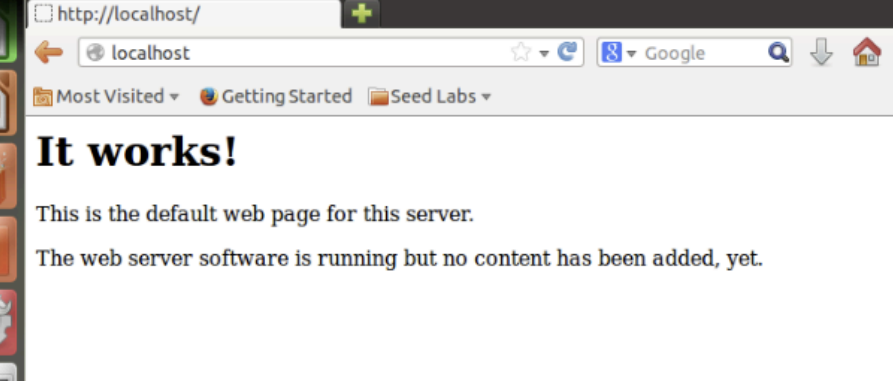
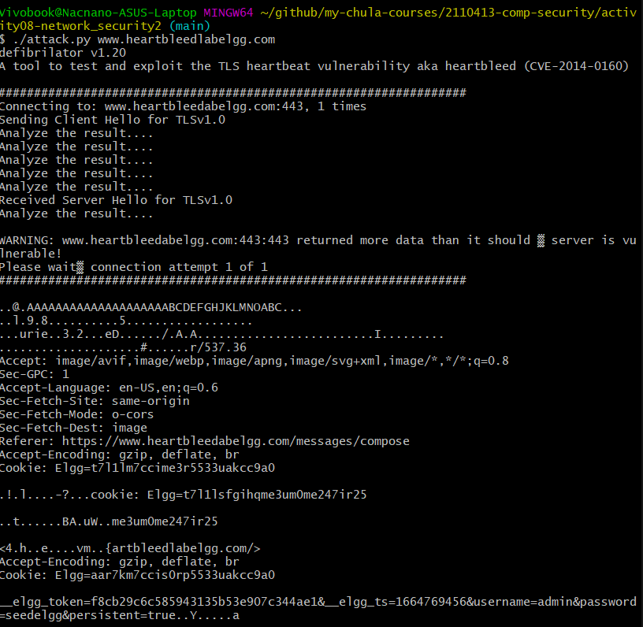
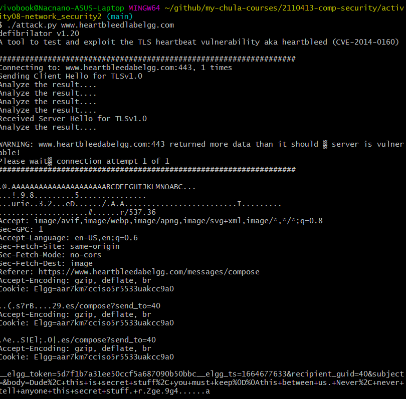
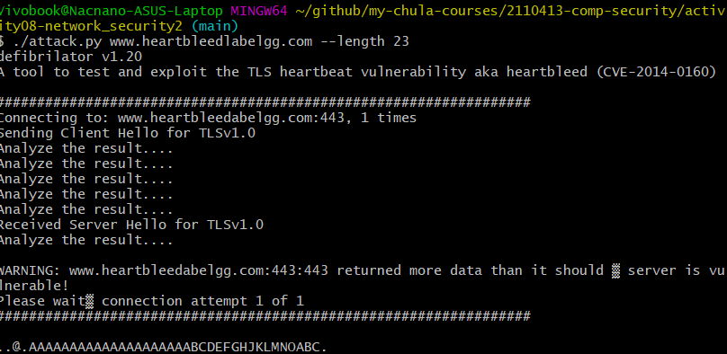
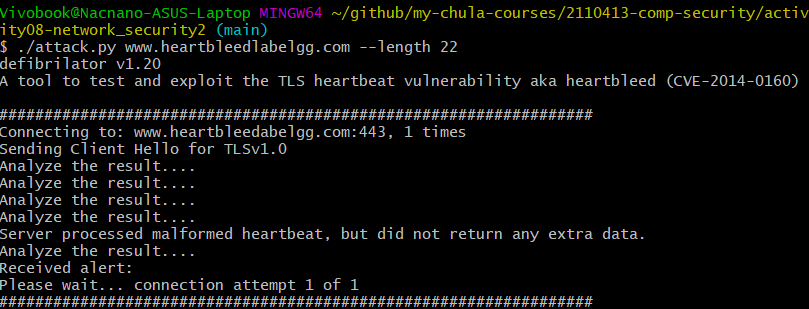

# Network Security — DoS & Heartbleed

## Part I. Preparing the Virtual Machine

## Part II. DoS (Denial of Service)

Victim VM’s IP: **192.168.1.57**
Attacker VM’s IP: **192.168.1.58**

1. **What is the attacker's IP address?**
   **Ans:** 192.168.1.58

2. **What command did you use to run the attack?**
   **Ans:** `sudo netwox 76 -i 192.168.1.57 -p 80`

3. **How do you know the attack is successful?**
   **Ans:** If SYN cookies are **off**, the browser fails to load the webpage (timeout / connection refused) even after force-reload. If SYN cookies are **on**, the webpage loads normally.

4. **Examples of spoofed IP addresses you see on the target machine**
   **Ans:** `185.60.216.35`, `13.226.75.100`, `203.119.45.67`
5. **What resource is exhausted? Number available and used**
   **Ans:** Server’s SYN/backlog queue (`sudo sysctl -q net.ipv4.tcp_max_syn_backlog`).

- **Configured:** `512`
- **Observed used during attack:** `256` (many `SYN-RECV` entries)

6. **How do TCP SYN cookies prevent this attack?**
   **Ans:** SYN cookies avoid allocating per-connection state for half-open handshakes by encoding state in the SYN-ACK sequence number. Only when a valid ACK returns does the server allocate connection state — spoofed SYNs don’t receive SYN-ACK and so consume no server memory.

---

## Part III. SSL Vulnerabilities (Heartbleed)

7. **Secrets stolen**
   **Ans:**

   #### Username and Password

   

   #### Private Massage

   

8. **How attack was performed & observations**
   **Ans:** Ran `./attack.py www.heartbleedlabelgg.com` (multiple runs). Output varies per run — sometimes readable secrets, sometimes garbage. Re-running yields different memory snapshots.

9. **As length variable decreases what changes?**
   **Ans:** Returned extra bytes decrease as length decreases; fewer extra memory bytes are leaked.
   
10. **Boundary length (value where no extra data returned)**
    **Ans:** **22** (at or below this value server replies without extra leaked data).
    
11. **After OpenSSL upgrade — successful?**
    **Ans:** After upgrading OpenSSL to 1.0.2 and restarting the VM, the attack no longer returns extra data — unable to steal secrets.

12. **Point out the code problem & fix**
    **Ans:** The line opaque payload[HeartbeatMessage.payload_length]; allocates an array using the client-supplied payload_length.
    If payload_length doesn't match the real payload size, extra sensitive memory can be leaked.

    Fix: validate that payload_length equals (or is ≤) the actual received payload size before copying.

13. **Comments on Alice/Bob/Eva**
    **Ans:**

- Agree with **Alice**: missing boundary checking is the fundamental cause.
- Agree with **Bob** (partially): this is an input-validation failure as well (they overlap).
- Disagree with **Eva**: removing the length field breaks the protocol — the correct fix is validation, not deletion.
