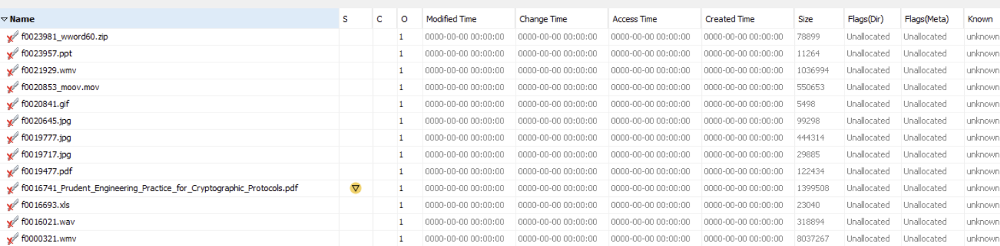
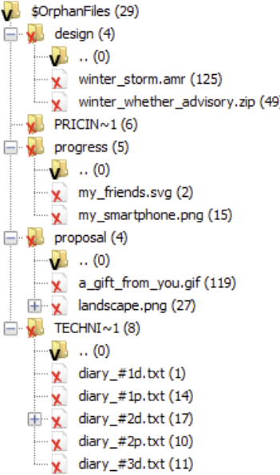
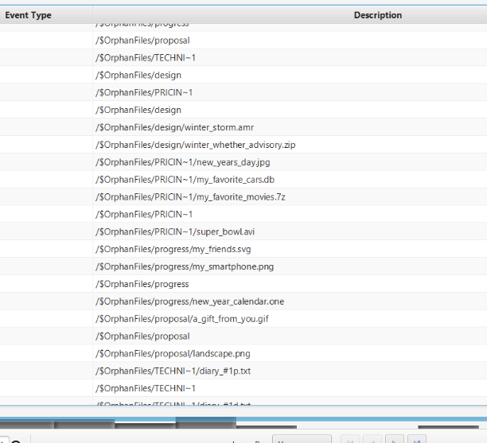
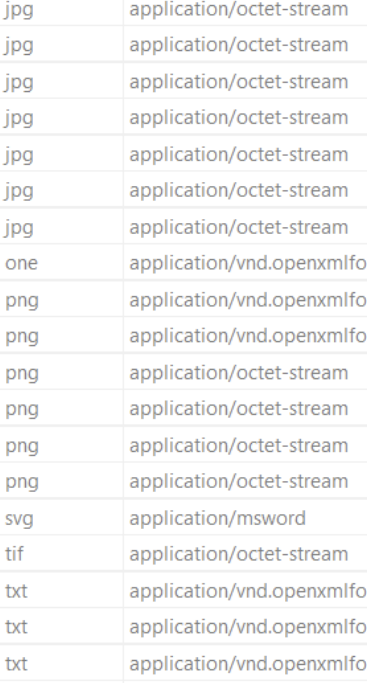
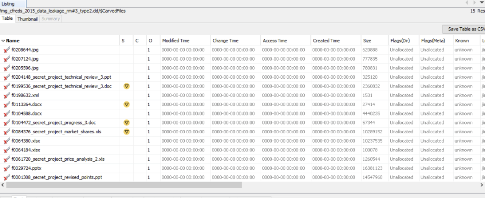
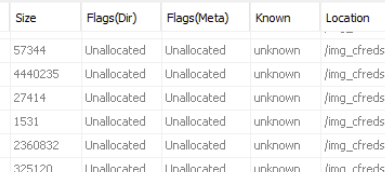

# **Computer Forensics Activity Report**

## **Overview**

This activity aims to practice digital forensics skills using the **Autopsy** forensic tool.
The exercise consists of two main parts:

1. **File Carving** – Recovering and analyzing files from a corrupted FAT32 disk image (`forensics-p2.dd`).
2. **Investigation** – Examining removable media for evidence of data leakage in a simulated corporate espionage scenario.

## **Part I: File Carving**

### **Question 1**

**Question:**
The file system has no files, but why are we able to find items on the disk image?

**Answer:**
Even though the file system appears empty, the **raw disk sectors** still contain remnants of data from previously allocated files.
The **File Allocation Table (FAT)**, which tracks file locations, is corrupted, but the underlying data blocks remain intact.
Autopsy uses **file signatures** and **header/footer patterns** during **data carving** to reconstruct files directly from these sectors, bypassing the damaged FAT structure.

---

### **Question 2**

**Question:**
How many objects can you find?

**Answer:**
A total of **14 objects** were detected on the disk image, matching the provided hint in the activity description.

---

### **Question 3**

**Question:**
List all the objects and report whether they are accessible or damaged/corrupted. Also, note which files were deleted.

**Answer:**

---

### **Question 4**

**Question:**
If we want to delete files on a magnetic hard disk so that they cannot be recovered by any tool, what must we do? How long would it take to wipe a 1TB hard disk?

**Answer:**
To securely erase data, the disk must be **overwritten with random data multiple times** (e.g., using tools like `shred` or `DBAN`).
A single overwrite can often suffice for modern drives, but **DoD 5220.22-M** recommends **3+ passes** for guaranteed erasure.
For a **1TB drive**, this process may take **5–10 hours**, depending on disk speed and interface (e.g., SATA vs. USB 3.0).

---

### **Question 5**

**Question:**
Will file carving be able to recover deleted files on an SSD? Why or why not?

**Answer:**
No, typically not.
SSDs use **TRIM commands**, which immediately erase data blocks once files are deleted.
This means the original data is physically cleared from flash memory, leaving **no recoverable remnants** for file carving tools.
Hence, **data recovery on SSDs is far less successful** than on traditional HDDs.

---

## **Part II: Investigation**

### **Question 1**

**Question:**
List all directories that were traversed in `RM#2`.

**Answer:**

---

### **Question 2**

**Question:**
List all files that were opened in `RM#2`.

**Answer:**

---

### **Question 3**

**Question:**
Recover deleted files from USB drive `RM#2`. What files were you able to recover?

**Answer:**

Every files from the `CarvedFiles` and `OrphanFiles` folders

---

### **Question 4**

**Question:**
What actions were performed for anti-forensics on USB drive `RM#2`?

**Answer:**
Renaming files before deleting with wrong extension types

---

### **Question 5**

**Question:**
Recover hidden files from the CD-R `RM#3`. What files were you able to recover?

**Answer:**

---

### **Question 6**

**Question:**
What actions were performed for anti-forensics (data hiding) on CD-R `RM#3`?

**Answer:**

Some files have `Unallocated` flag meaning that there were some attempts for formatting the CD-R to hide some files.

