# DVWA Vulnerability Assessment and Mitigation Report

**Part A (60%)**

The following report details the vulnerabilities identified within the Damn Vulnerable Web Application (DVWA)
---

## 1. Brute Force

**Vulnerability Information**
*   **URL Endpoint:** `/vulnerabilities/brute/`
*   **Method:** GET / POST
*   **Description:**
    As described in the PDF (Page 2), a Brute Force attack involves an attacker attempting various combinations of usernames and passwords (using dictionaries or wordlists) to guess valid credentials. The application fails to limit the number of login attempts, allowing automated tools like Burp Suite Intruder to cycle through thousands of attempts until the correct password is found.

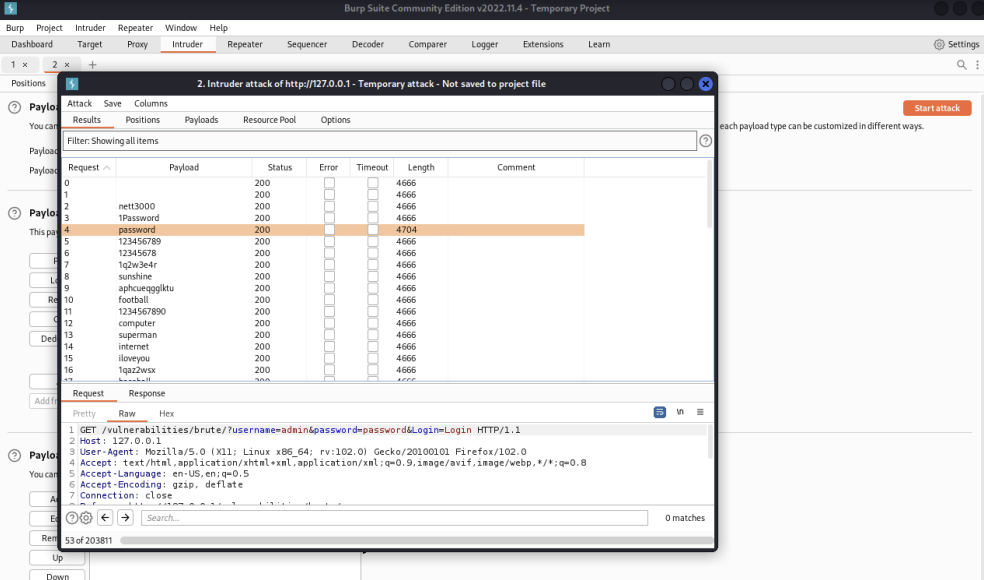

**Risk Score (OWASP Criteria)**

| Criteria | Level | Score (1-3) | Justification |
| :--- | :--- | :--- | :--- |
| **Exploitability** | Easy | 3 | Tools like Hydra or Burp Suite make this trivial to automate. |
| **Prevalence** | Common | 3 | Extremely common on login forms without protection. |
| **Detectability** | Easy | 3 | High traffic volume from a single IP is easily spotted in logs. |
| **Technical Impact** | Severe | 3 | unauthorized access to user accounts or admin privileges. |
| **Average Risk** | **High** | **3.0** | |

**Fix / Mitigation Methodology**
To fix this vulnerability, the application must stop unlimited attempts.
1.  **Account Lockout:** Implement a mechanism that locks the user account after a specific number of failed attempts (e.g., 3 to 5 failures). The account can be unlocked after a set duration or via email verification.
2.  **CAPTCHA:** Integrate a CAPTCHA (e.g., reCAPTCHA) on the login form to prevent automated bots from submitting requests.
3.  **Artificial Delay:** As seen in the "Medium" level of the PDF, adding a `sleep()` function slows down the attack, but a hard lockout is more effective.
4.  **Multi-Factor Authentication (MFA):** Require a secondary token (OTP) which makes password guessing useless.

---

## 2. Command Injection

**Vulnerability Information**
*   **URL Endpoint:** `/vulnerabilities/exec/`
*   **Method:** POST
*   **Description:**
    The application takes an IP address as input to run a `ping` command but does not sanitize the input. As shown in the PDF (Page 5), attackers can use command separators (like `;`, `|`, `&&`) to chain commands. For example, entering `127.0.0.1; cat /etc/passwd` executes the ping and then prints the system's password file.

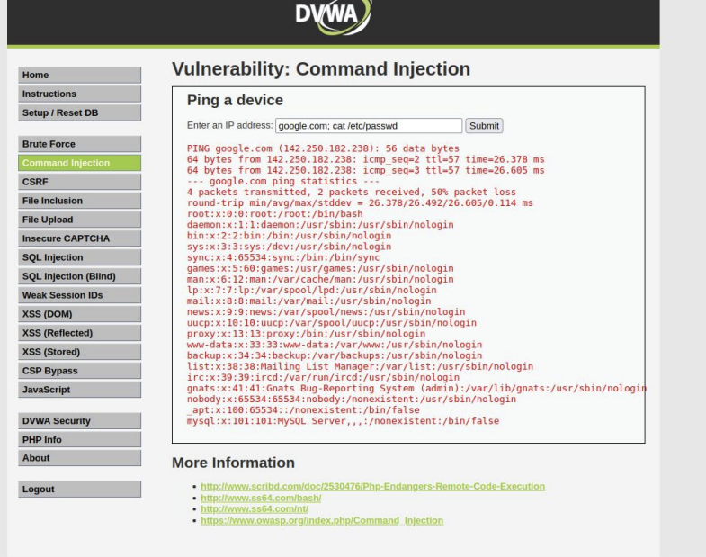

**Risk Score (OWASP Criteria)**

| Criteria | Level | Score (1-3) | Justification |
| :--- | :--- | :--- | :--- |
| **Exploitability** | Easy | 3 | Simple text input manipulation requires no special tools. |
| **Prevalence** | Moderate | 2 | Less common in modern frameworks but devastating when present. |
| **Detectability** | Easy | 3 | Input patterns are distinct; monitoring system calls reveals this. |
| **Technical Impact** | Severe | 3 | Full compromise of the server (Remote Code Execution). |
| **Average Risk** | **Critical** | **2.75** | |

**Fix / Mitigation Methodology**
1.  **Avoid Shell Execution:** Do not use functions like `shell_exec()`, `exec()`, `system()`, or `passthru()` with user input. Use language-specific APIs instead (e.g., use a native PHP library to ping or DNS lookup rather than calling the OS command).
2.  **Input Validation (Allowlist):** If system commands are unavoidable, validate the input against a strict regular expression (e.g., only allow numbers and dots for an IP address).
3.  **escapeshellarg():** In PHP, use `escapeshellarg()` and `escapeshellcmd()` to escape user input before passing it to the shell, rendering separators like `;` or `&&` ineffective as commands.

---

## 3. File Inclusion (LFI / RFI)

**Vulnerability Information**
*   **URL Endpoint:** `/vulnerabilities/fi/?page=...`
*   **Method:** GET
*   **Description:**
    The application includes files based on the `page` URL parameter without validation.
    *   **Local File Inclusion (LFI):** As seen on Page 8, attackers can traverse directories (`../../etc/passwd`) to read sensitive server files.
    *   **Remote File Inclusion (RFI):** Attackers can load malicious code from an external server (e.g., `http://google.com` or a malicious shell) if `allow_url_include` is enabled in PHP.

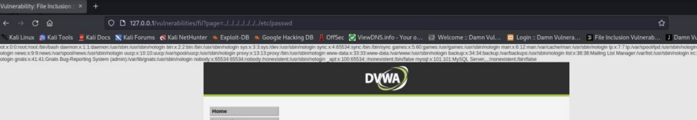

**Risk Score (OWASP Criteria)**

| Criteria | Level | Score (1-3) | Justification |
| :--- | :--- | :--- | :--- |
| **Exploitability** | Easy | 3 | Modifying a URL parameter is trivial. |
| **Prevalence** | Common | 3 | Common in CMS or poorly written PHP apps. |
| **Detectability** | Average | 2 | Logs show path traversal attempts (`../`), but can be obfuscated. |
| **Technical Impact** | Severe | 3 | Can lead to Information Disclosure or RCE. |
| **Average Risk** | **High** | **2.75** | |

**Fix / Mitigation Methodology**
1.  **Disable Remote Execution:** In `php.ini`, set `allow_url_fopen` and `allow_url_include` to `Off` to prevent RFI.
2.  **Use an Allowlist (Map):** Do not pass the user input directly to the `include()` function. Use a `switch` statement or an array map:
    ```php
    $files = ['home' => 'home.php', 'profile' => 'profile.php'];
    if (array_key_exists($_GET['page'], $files)) {
        include($files[$_GET['page']]);
    } else {
        // Error page
    }
    ```
3.  **Sanitize Input:** Block directory traversal characters (`../` and `..\`).

---

## 4. File Upload

**Vulnerability Information**
*   **URL Endpoint:** `/vulnerabilities/upload/`
*   **Method:** POST
*   **Description:**
    The application allows users to upload files without properly validating the file content or extension. As demonstrated in the PDF (Page 14), an attacker can generate a PHP reverse shell using `msfvenom` (e.g., `hackkk.php`) and upload it. Once accessed via the browser, the server executes the PHP code, granting the attacker control over the server.

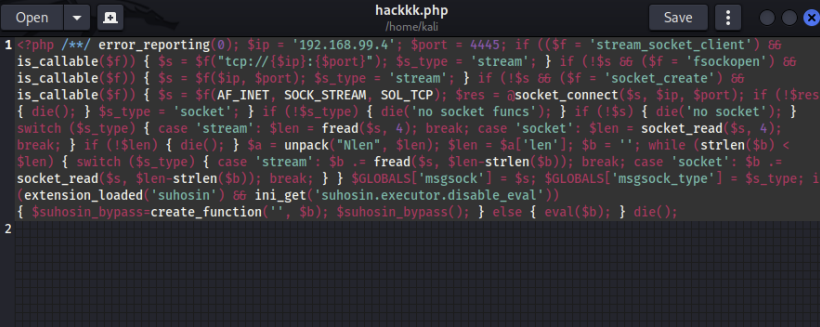

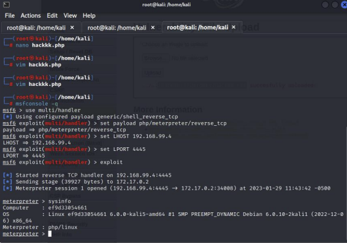

**Risk Score (OWASP Criteria)**

| Criteria | Level | Score (1-3) | Justification |
| :--- | :--- | :--- | :--- |
| **Exploitability** | Easy | 3 | Standard file upload form; simple bypass techniques. |
| **Prevalence** | Common | 2 | Many apps have upload features; validation often weak. |
| **Detectability** | Average | 2 | Shell files often have distinct signatures, but can be hidden. |
| **Technical Impact** | Severe | 3 | Complete system takeover (Remote Code Execution). |
| **Average Risk** | **High** | **2.5** | |

**Fix / Mitigation Methodology**
1.  **Validate File Type (Content):** Do not rely on the `Content-Type` header (which can be spoofed). Check the file's Magic Numbers (byte signatures) server-side.
2.  **Allowlist Extensions:** Only allow specific safe extensions (e.g., `.jpg`, `.png`). Reject everything else.
3.  **Rename Files:** Randomize the filename upon saving to prevent overwriting or guessing paths.
4.  **Store Outside Web Root:** Save uploaded files to a directory that cannot be accessed directly via a URL.
5.  **Disable Execution:** Configure the web server (Apache/Nginx) to disable script execution in the upload directory.

---

## 5. SQL Injection (Classic)

**Vulnerability Information**
*   **URL Endpoint:** `/vulnerabilities/sqli/`
*   **Method:** GET / POST
*   **Description:**
    The application takes the `User ID` input and concatenates it directly into a SQL query string. As shown on Page 21, an attacker can input `' or '1'='1` or usage `UNION SELECT` statements to bypass authentication or retrieve the entire database (usernames, password hashes) as displayed in the output.

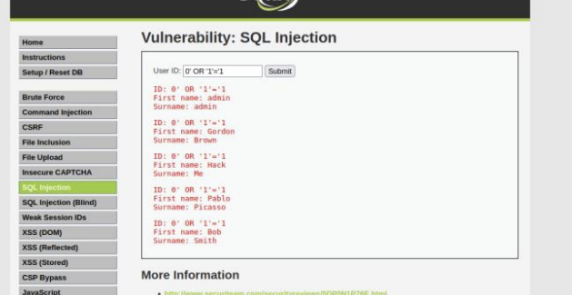

**Risk Score (OWASP Criteria)**

| Criteria | Level | Score (1-3) | Justification |
| :--- | :--- | :--- | :--- |
| **Exploitability** | Easy | 3 | Trivial to automate or exploit manually with basic knowledge. |
| **Prevalence** | Common | 3 | Still #1 on OWASP Top 10 lists for years. |
| **Detectability** | Easy | 3 | SQL syntax errors or strange database logs make it visible. |
| **Technical Impact** | Severe | 3 | Complete database breach, data loss, or auth bypass. |
| **Average Risk** | **Critical** | **3.0** | |

**Fix / Mitigation Methodology**
1.  **Prepared Statements (Parameterized Queries):** This is the primary defense. Instead of concatenating strings, use placeholders.
    *   *Vulnerable:* `SELECT * FROM users WHERE id = '$id';`
    *   *Secure (PDO):*
        ```php
        $stmt = $pdo->prepare('SELECT * FROM users WHERE id = :id');
        $stmt->execute(['id' => $id]);
        ```
    This ensures the database treats the input as data, not executable code.
2.  **Input Validation:** Ensure the ID is strictly an integer before processing.

---

## 6. Blind SQL Injection

**Vulnerability Information**
*   **URL Endpoint:** `/vulnerabilities/sqli_blind/`
*   **Method:** GET
*   **Description:**
    Unlike classic SQLi, this vulnerability does not return database errors or data to the screen. However, as described on Page 26, the application acts differently (e.g., returns a "User exists" message or HTTP 200 vs 404) based on true/false SQL queries. Attackers use time-based attacks (`SLEEP()`) or boolean inference using tools like `sqlmap` to extract data bit-by-bit.

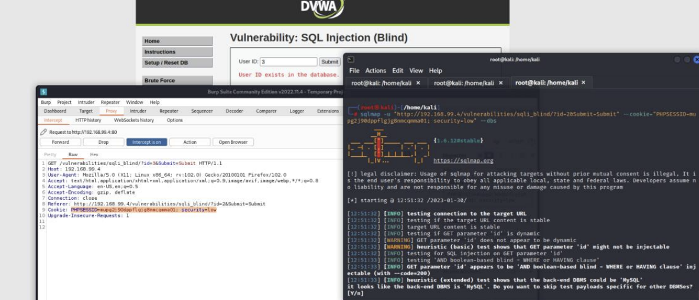

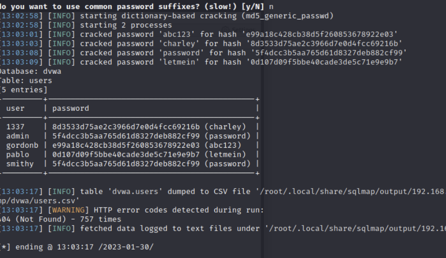

**Risk Score (OWASP Criteria)**

| Criteria | Level | Score (1-3) | Justification |
| :--- | :--- | :--- | :--- |
| **Exploitability** | Average | 2 | Requires more patience or automated tools (sqlmap). |
| **Prevalence** | Common | 3 | Occurs wherever SQLi exists but error reporting is off. |
| **Detectability** | Average | 2 | High volume of similar requests (thousands) indicates extraction. |
| **Technical Impact** | Severe | 3 | Same as classic SQLi: full data exfiltration. |
| **Average Risk** | **High** | **2.5** | |

**Fix / Mitigation Methodology**
1.  **Prepared Statements:** As with Classic SQLi, utilizing Parameterized Queries completely neutralizes this threat.
2.  **Generic Error Messages:** Ensure the application returns generic error messages to prevent Boolean-based inference (though this does not stop time-based attacks).
3.  **WAF:** A Web Application Firewall can detect and block SQL injection patterns.

---

## 7. Weak Session IDs

**Vulnerability Information**
*   **URL Endpoint:** `/vulnerabilities/weak_id/`
*   **Method:** POST (Generate)
*   **Description:**
    The application uses predictable algorithms to generate session cookies.
    *   **Low Level (Page 32):** The `dvwaSession` cookie increments sequentially (1, 2, 3...). An attacker can simply guess the next number to hijack a user's session.
    *   **Medium/High Level:** It uses timestamps or MD5 hashes of sequential numbers, which are easily reversible or predictable.

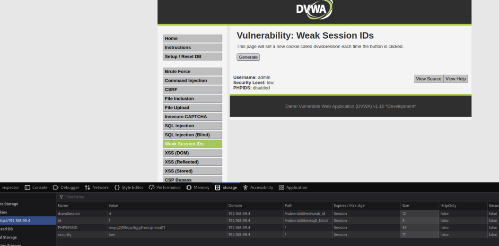

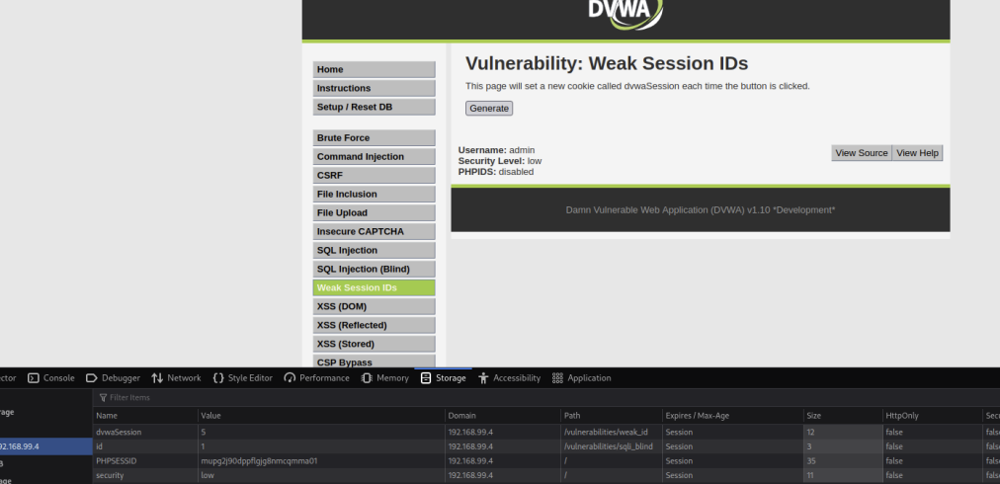


**Risk Score (OWASP Criteria)**

| Criteria | Level | Score (1-3) | Justification |
| :--- | :--- | :--- | :--- |
| **Exploitability** | Easy | 3 | Predictable patterns are trivial to script against. |
| **Prevalence** | Average | 2 | Common in custom-built auth systems; rare in frameworks. |
| **Detectability** | Hard | 1 | Access looks like legitimate user traffic. |
| **Technical Impact** | Severe | 3 | Account Takeover (ATO) without needing a password. |
| **Average Risk** | **High** | **2.25** | |

**Fix / Mitigation Methodology**
1.  **Use Framework Management:** Do not create custom session generation logic. Use standard, built-in functions like PHP's `session_start()`.
2.  **High Entropy:** Ensure Session IDs are long, random, and have high entropy (randomness) so they cannot be guessed.
3.  **Secure Flags:** Set `Secure` and `HttpOnly` flags on cookies to prevent interception over HTTP or access via JavaScript.

---

## 8. DOM-Based Cross-Site Scripting (XSS)

**Vulnerability Information**
*   **URL Endpoint:** `/vulnerabilities/xss_d/`
*   **Method:** GET
*   **Description:**
    This vulnerability occurs in the client-side code (JavaScript). As shown on Page 34, the application takes the `default` URL parameter and writes it directly into the DOM (e.g., inside a `<select>` value) without validation. An attacker can use a payload like `?default=<script>alert('XSS')</script>` which the browser executes.

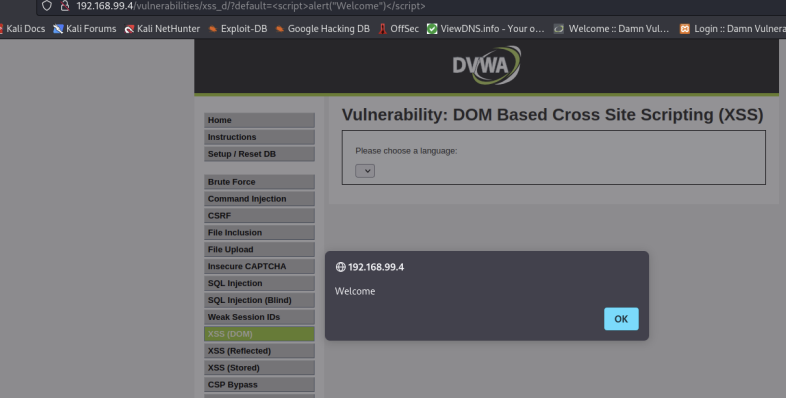

**Risk Score (OWASP Criteria)**

| Criteria | Level | Score (1-3) | Justification |
| :--- | :--- | :--- | :--- |
| **Exploitability** | Average | 2 | Requires user interaction (clicking a link). |
| **Prevalence** | Common | 2 | Very common in Single Page Applications (SPAs). |
| **Detectability** | Hard | 1 | Often processed entirely client-side; server logs may not show it. |
| **Technical Impact** | Moderate | 2 | Session hijacking, redirection, phishing. |
| **Average Risk** | **Moderate** | **1.75** | |

**Fix / Mitigation Methodology**
1.  **Avoid Dangerous Sinks:** Avoid using `document.write()`, `innerHTML`, or `outerHTML` with user-controlled data.
2.  **Use Safe Methods:** Use `textContent` or `innerText` to set content, which treats input as text rather than HTML/Script.
3.  **URL Encoding:** Ensure parameters read from the URL are properly encoded before being used in the DOM.

---

## 9. Reflected Cross-Site Scripting (XSS)

**Vulnerability Information**
*   **URL Endpoint:** `/vulnerabilities/xss_r/`
*   **Method:** GET
*   **Description:**
    The application takes the input from the `name` parameter and immediately reflects it back onto the page in a "Hello [Name]" message (Page 37). Because the input is not sanitized, entering `<script>alert(1)</script>` causes the script to run in the victim's browser.

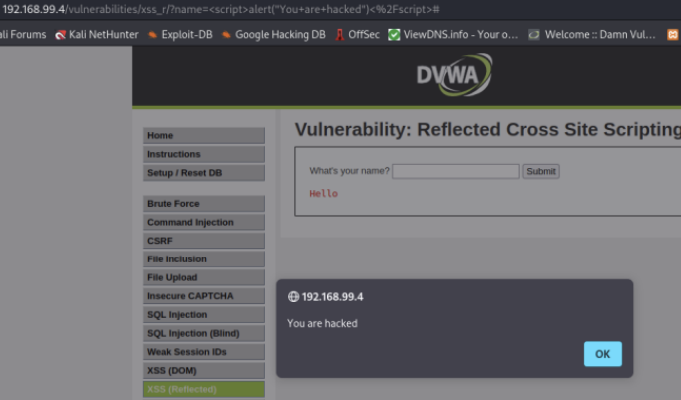

**Risk Score (OWASP Criteria)**

| Criteria | Level | Score (1-3) | Justification |
| :--- | :--- | :--- | :--- |
| **Exploitability** | Average | 2 | Requires social engineering (sending a link to a victim). |
| **Prevalence** | Common | 3 | Very common issue in search bars and error messages. |
| **Detectability** | Average | 2 | Can be detected by WAFs, but payloads can be obfuscated. |
| **Technical Impact** | Moderate | 2 | Cookie theft, session hijacking, defacement. |
| **Average Risk** | **Moderate** | **2.25** | |

**Fix / Mitigation Methodology**
1.  **Output Encoding:** Convert special characters to HTML entities before rendering them in the browser. In PHP, use `htmlspecialchars($input, ENT_QUOTES, 'UTF-8')`. This converts `<` to `&lt;`, rendering the tag harmless.
2.  **Input Validation:** Validate that the input conforms to expected formats (e.g., a name should only contain letters).

---

## 10. Stored Cross-Site Scripting (XSS)

**Vulnerability Information**
*   **URL Endpoint:** `/vulnerabilities/xss_s/`
*   **Method:** POST
*   **Description:**
    As described on Page 39, this is the most dangerous form of XSS. The attacker posts a malicious script (e.g., into a Guestbook comment). This script is saved in the database. Every time *any* user views the guestbook, the script executes. The PDF shows bypassing client-side length limits to inject the payload.

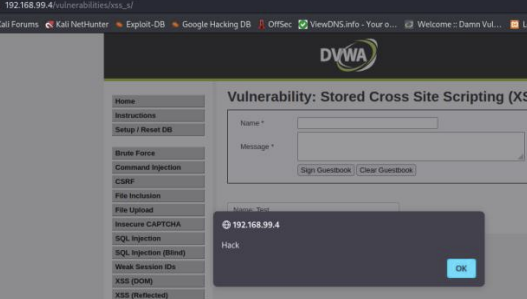


**Risk Score (OWASP Criteria)**

| Criteria | Level | Score (1-3) | Justification |
| :--- | :--- | :--- | :--- |
| **Exploitability** | Easy | 3 | Just submitting a form; no social engineering required for the attack itself. |
| **Prevalence** | Common | 2 | Common in forums, comment sections, and user profiles. |
| **Detectability** | Easy | 3 | The malicious data persists in the database. |
| **Technical Impact** | Severe | 3 | Affects all users viewing the page; potential for mass-worm propagation. |
| **Average Risk** | **Critical** | **2.75** | |

**Fix / Mitigation Methodology**
1.  **Output Encoding (Context Aware):** Encode data strictly when retrieving it from the database and displaying it to the user. Use `htmlspecialchars()` in PHP.
2.  **Content Security Policy (CSP):** Implement a strict CSP header that restricts where scripts can load from, mitigating the impact if injection occurs.
3.  **Input Sanitization:** While output encoding is better, using libraries like HTML Purifier to strip dangerous tags from input before storage can be a defense-in-depth measure.

---

## 11. Content Security Policy (CSP) Bypass

**Vulnerability Information**
*   **URL Endpoint:** `/vulnerabilities/csp/`
*   **Method:** POST / GET
*   **Description:**
    CSP is a defense mechanism, but it can be bypassed if misconfigured. The PDF (Page 42) shows a policy allowing `unsafe-inline` or scripts from trusted domains like `pastebin.com`. An attacker can host malicious code on the "trusted" domain (Pastebin) and inject a `<script src="...">` pointing to it, or use JSONP callback manipulation to execute code despite the CSP.

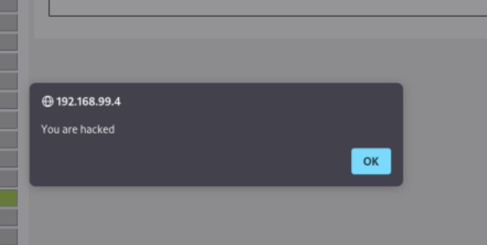
**Risk Score (OWASP Criteria)**

| Criteria | Level | Score (1-3) | Justification |
| :--- | :--- | :--- | :--- |
| **Exploitability** | Hard | 1 | Requires understanding complex policy configurations. |
| **Prevalence** | Increasing | 2 | As CSP adoption grows, misconfigurations become more common. |
| **Detectability** | Average | 2 | Browser console reports CSP violations. |
| **Technical Impact** | Moderate | 2 | Successfully bypassing CSP re-enables XSS attacks. |
| **Average Risk** | **Moderate** | **1.75** | |

**Fix / Mitigation Methodology**
1.  **Strict Policy:** Remove `unsafe-inline` and `unsafe-eval`.
2.  **Nonces/Hashes:** Use cryptographic Nonces (numbers used once) for inline scripts. The script tag must include a nonce attribute that matches the header: `<script nonce="randomValue">`.
3.  **Restrict Domains:** Be very specific with allowed domains. Avoid general whitelisting of CDN sites or raw content sites (like Pastebin) that allow user-generated content.