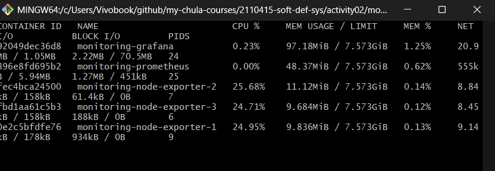
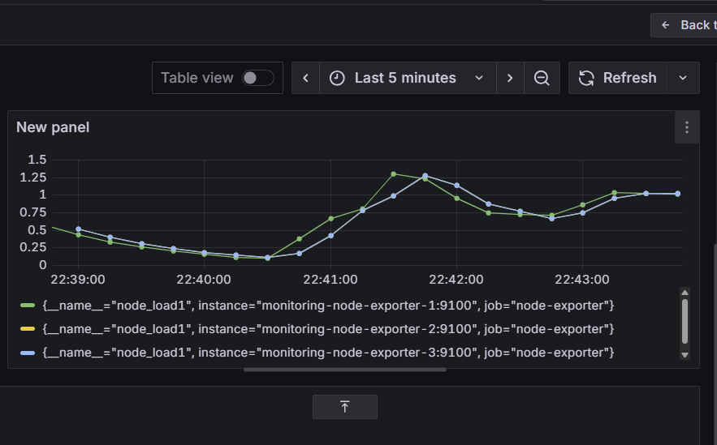

# Docker Compose

```
services:
  node-exporter:
    image: prom/node-exporter:latest
    command:
      - "--path.procfs=/host/proc"
      - "--path.rootfs=/rootfs"
      - "--path.sysfs=/host/sys"
      - "--collector.filesystem.mount-points-exclude=^/(sys|proc|dev|host|etc)($$|/)"
    volumes:
      - "/proc:/host/proc:ro"
      - "/sys:/host/sys:ro"
      - "/:/rootfs:ro"
    ports:
      - "9100"
    networks:
      - monitoring
    deploy:
      resources:
        limits:
          cpus: "0.25"
    restart: unless-stopped

  prometheus:
    image: prom/prometheus:latest
    container_name: monitoring-prometheus
    ports:
      - "9090:9090"
    volumes:
      - ./prometheus.yml:/etc/prometheus/prometheus.yml
    networks:
      - monitoring
    depends_on:
      - node-exporter
    restart: unless-stopped

  grafana:
    image: grafana/grafana:latest
    container_name: monitoring-grafana
    ports:
      - "3000:3000"
    environment:
      - GF_SECURITY_ADMIN_PASSWORD=admin
    networks:
      - monitoring
    depends_on:
      - prometheus
    restart: unless-stopped

networks:
  monitoring:
    driver: bridge

volumes:
  prometheus_data:
  grafana_data:
```

# Prometheus

```
global:
  scrape_interval: 15s
  evaluation_interval: 15s

scrape_configs:
  - job_name: "prometheus"
    static_configs:
      - targets: ["localhost:9090"]

  - job_name: "node-exporter"
    static_configs:
      - targets:
          - monitoring-node-exporter-1:9100
          - monitoring-node-exporter-2:9100
          - monitoring-node-exporter-3:9100
```




