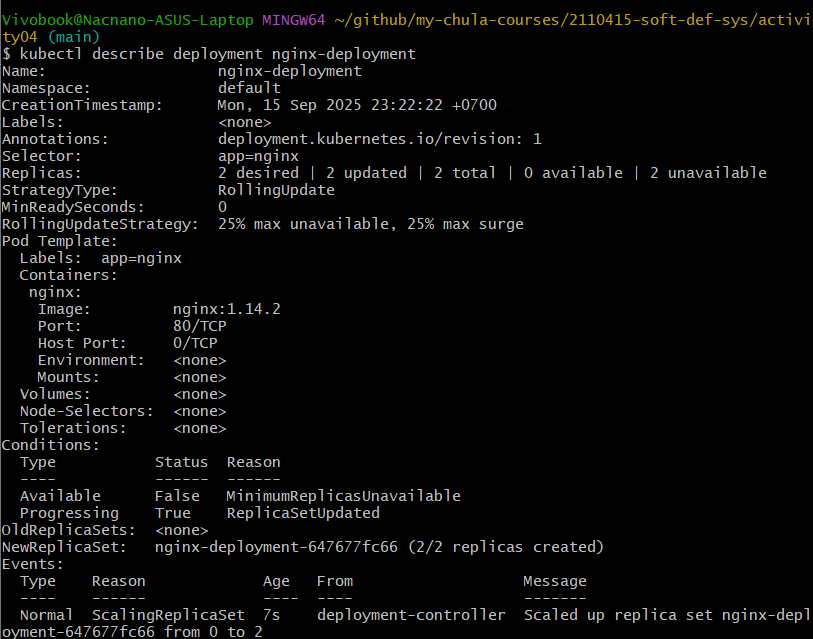
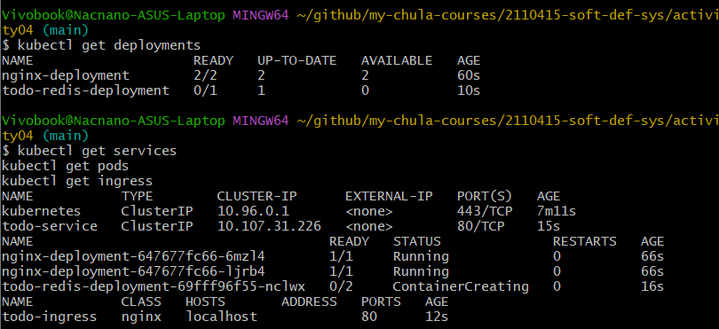
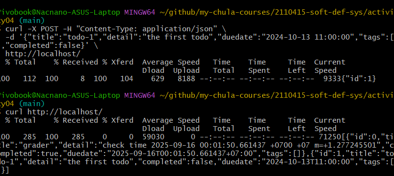

## Todo Deployment

```
apiVersion: apps/v1
kind: Deployment
metadata:
  name: todo-redis-deployment
  labels:
    app: todo-redis
spec:
  replicas: 1
  selector:
    matchLabels:
      app: todo-redis
  template:
    metadata:
      labels:
        app: todo-redis
    spec:
      containers:
        - name: todo
          image: natawut/todo-service:release-2.1
          ports:
            - containerPort: 8000
          env:
            - name: REDIS_HOST
              value: "localhost"
        - name: redis
          image: redis:alpine
          ports:
            - containerPort: 6379
---
apiVersion: v1
kind: Service
metadata:
  name: todo-service
spec:
  selector:
    app: todo-redis
  ports:
    - protocol: TCP
      port: 80
      targetPort: 8000
  type: ClusterIP

```

## Todo Ingress

```
apiVersion: networking.k8s.io/v1
kind: Ingress
metadata:
  name: todo-ingress
  annotations:
    nginx.ingress.kubernetes.io/rewrite-target: /
spec:
  ingressClassName: nginx
  rules:
    - host: localhost
      http:
        paths:
          - path: /
            pathType: Prefix
            backend:
              service:
                name: todo-service
                port:
                  number: 80
```

## Nginx



## Status



## Curl


