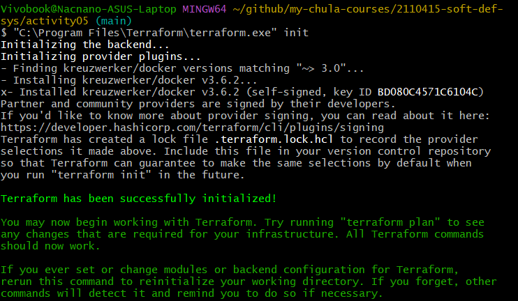
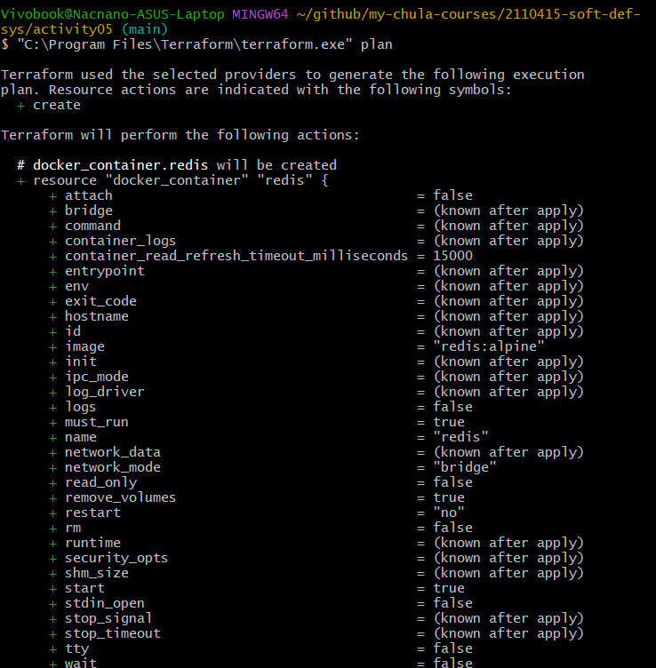
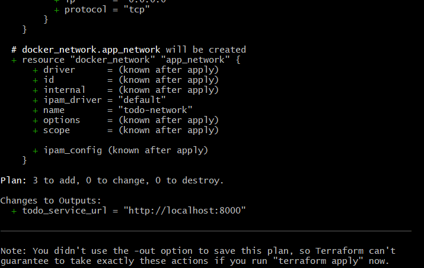
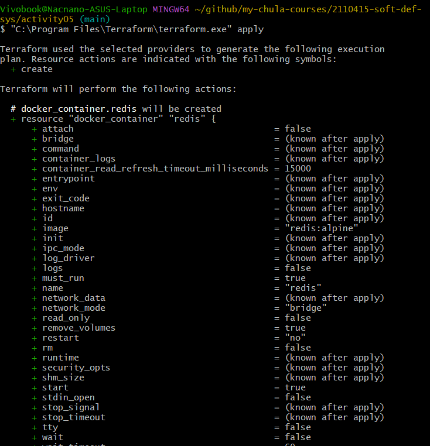
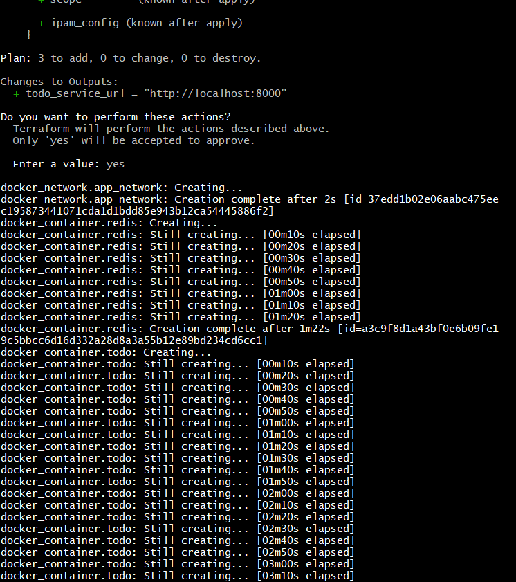
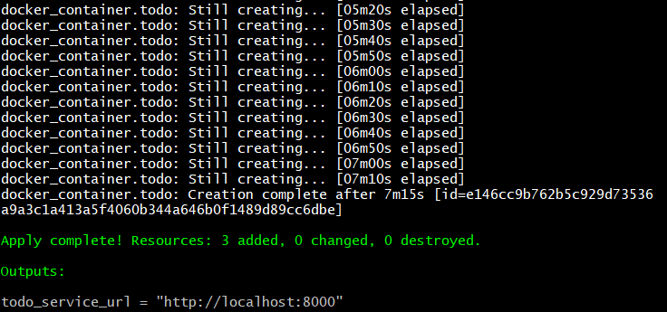

```
terraform {
  required_providers {
    docker = {
      source  = "kreuzwerker/docker"
      version = "~> 3.0"
    }
  }
}

provider "docker" {}

# Custom network for both services
resource "docker_network" "app_network" {
  name = "todo-network"
}

# Redis container
resource "docker_container" "redis" {
  name  = "redis"
  image = "redis:alpine"

  networks_advanced {
    name = docker_network.app_network.name
  }

  ports {
    internal = 6379
    external = 6379
  }
}

# Todo service container
resource "docker_container" "todo" {
  name  = "todo-service"
  image = "natawut/todo-service:release-2.1"

  networks_advanced {
    name = docker_network.app_network.name
  }

  ports {
    internal = 8000
    external = 8000
  }

  env = [
    "REDIS_HOST=redis"
  ]

  depends_on = [docker_container.redis]
}

# Output the todo-service URL
output "todo_service_url" {
  value = "http://localhost:8000"
}
```












