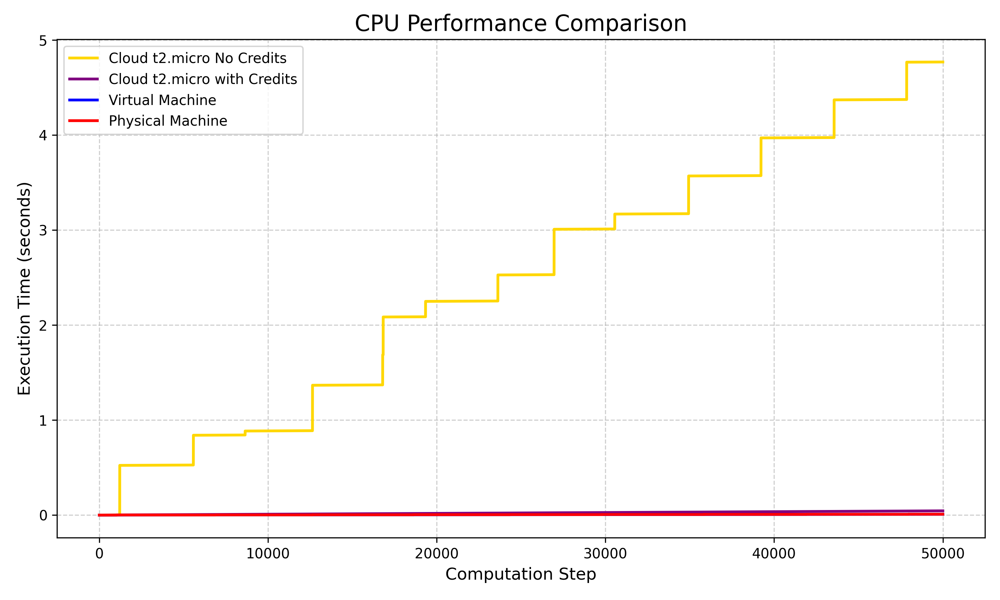
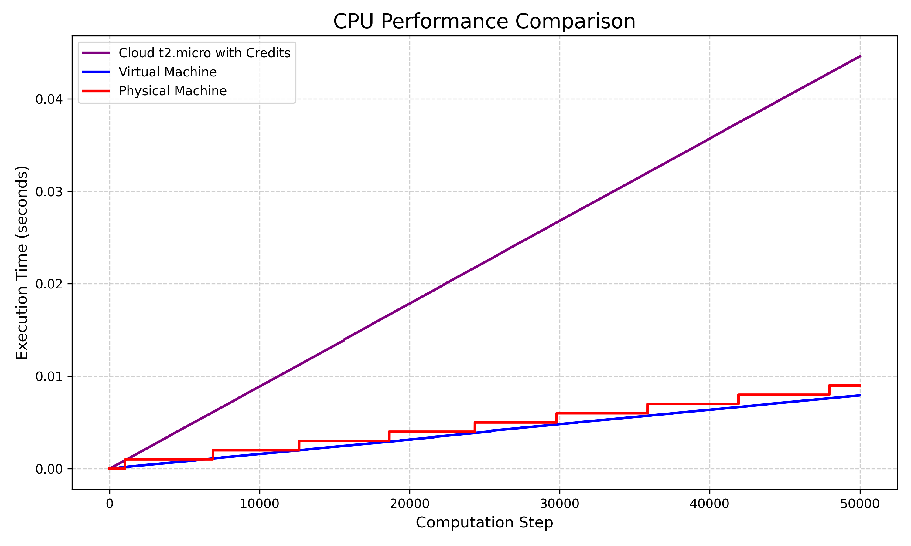

# CPU Performance Comparison Report

## Overview

This report analyzes CPU performance across four different environments:

1. **Cloud t2.micro No Credits**
2. **Cloud t2.micro with Credits**
3. **Virtual Machine**
4. **Physical Machine**

Each test measured CPU computation times from the file results:

- `cpu_results_no_credits.txt`
- `cpu_results_with_credits.txt`
- `cpu_results_VM.txt`
- `cpu_results.txt`

The data represents time in **seconds** vs. computation step.

---

## 1. Experimental Setup

| Scenario                    | CPU Speed (GHz) | Time to Run (s) |
| --------------------------- | --------------- | --------------- |
| Cloud t2.micro No Credits   | 2.4             | 4.76723289      |
| Cloud t2.micro with Credits | 2.4             | 0.04370307      |
| Virtual Machine             | 3.6             | 0.00778150      |
| Physical Machine            | 3.6             | 0.01073980      |

---

## 2. Plot: CPU Performance Comparison

Below is a comparative graph showing runtime behavior for each scenario.

> Generated using the accompanying Python script in this project.

---

## 3. Analysis

### 3.1 What is a CPU Credit in AWS?

A **CPU Credit** is a performance unit that allows EC2 instances to burst above baseline CPU utilization. When utilization is below baseline, credits accumulate; when it exceeds baseline, credits are consumed.

### 3.2 Benefits

| Perspective        | Benefit                                                                         |
| ------------------ | ------------------------------------------------------------------------------- |
| **Cloud User**     | Can burst CPU performance during high-demand periods without constant cost.     |
| **Cloud Provider** | Can overcommit CPUs by sharing idle compute among users, increasing efficiency. |

---

## 4. Discussion

- **Scenario 1 (No Credits)** took the longest runtime (>4.5s).
- **Scenario 2 (With Credits)** completed the task in <0.05s.
- Both **VM** and **Physical Machine** (3.6 GHz) outperformed cloud instances.

From the plot:

- The **purple line (t2.micro with Credits)** performs similarly to **blue (VM)** and **red (Physical)**, while **gold (No Credits)** is significantly slower.

### 4.1 Local vs Cloud

Yes, the **local notebook** is faster than the **t2.micro instance**, since:

- It has a higher CPU speed (3.6 GHz vs. 2.4 GHz).
- It has dedicated cores, unlike the shared vCPU on the cloud.

### 4.2 VM vs Physical Machine

The **VM** slightly outperforms the **Physical Machine**, likely due to fewer background processes and a leaner operating system (Debian VM vs. Windows host).

---

## 5. Conclusion

- **CPU Credits** significantly impact burstable cloud instance performance.
- **Local environments** remain superior for short, CPU-intensive tasks.
- **Virtualization overhead** can be minimal or even beneficial depending on the OS and resource allocation.

---
