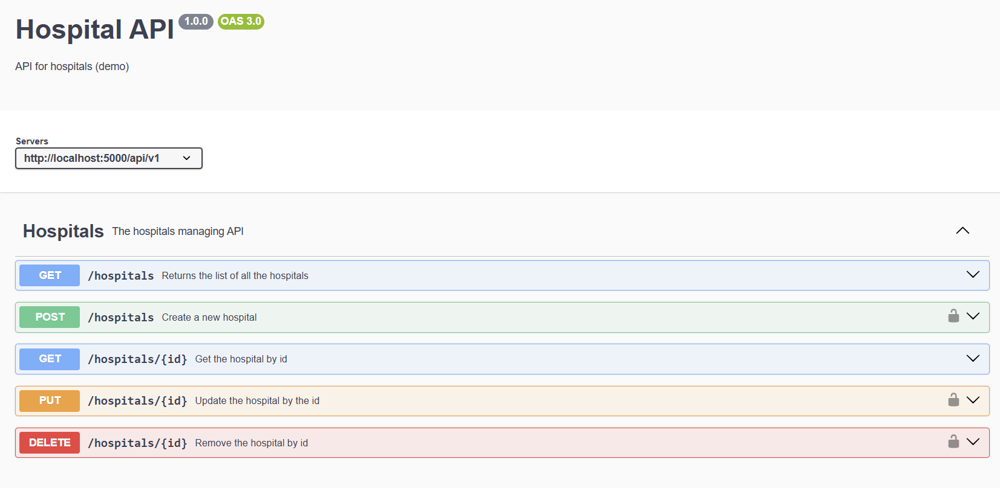
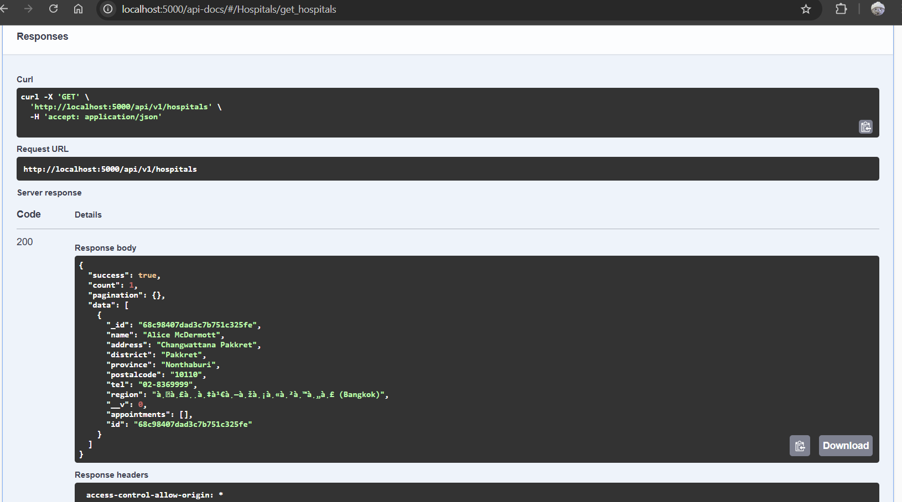

# NOTE: My Postman in my laptop doesn't open. I tried reunistall and fix it multiple tries, but couldn't solve it.

# Use the curl command instead. T_T SO PAIN

## Chapter 12

1. Logout

2. SQL injection prevention

3. Helmet

4. XSS

5. Express-rate-limit

## Chapter 13

1. Swagger

2. Get Hospitals from Swagger

