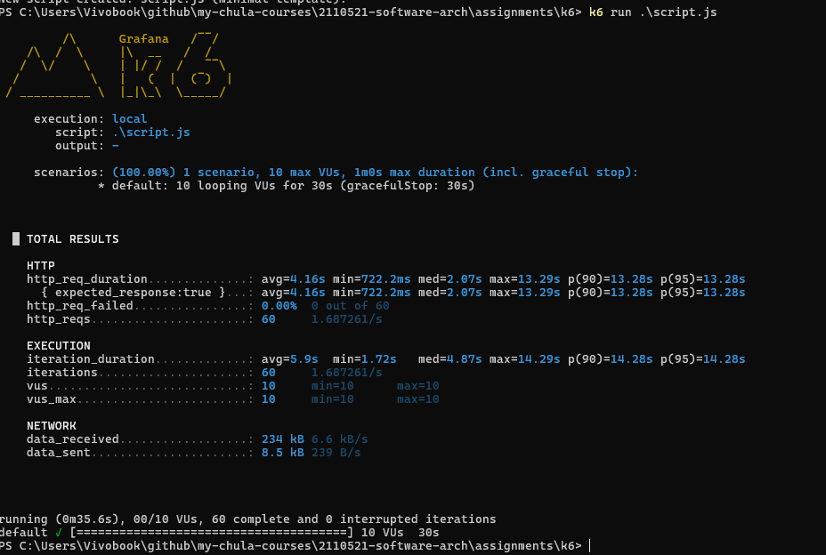
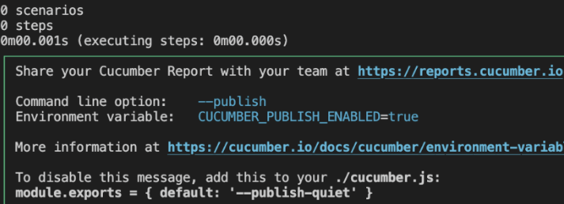
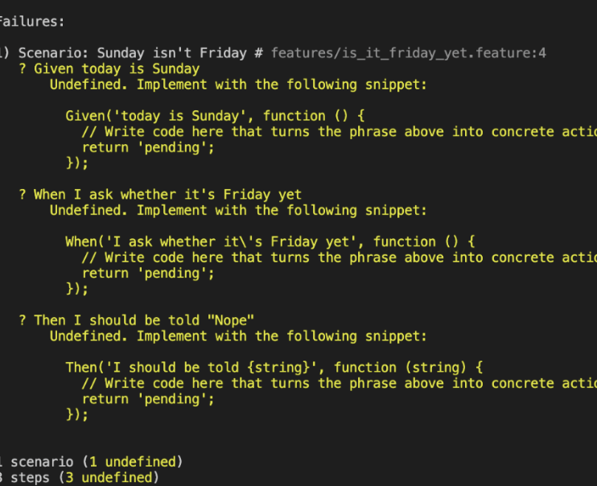
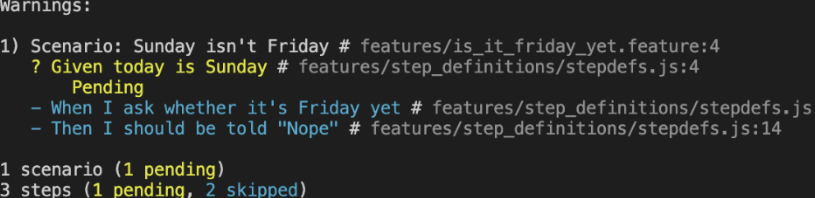
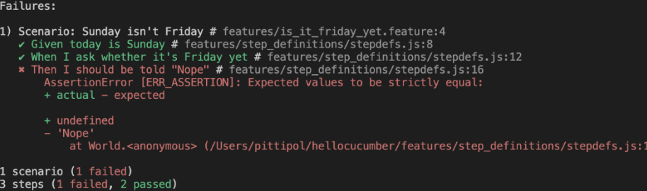
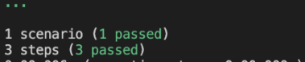
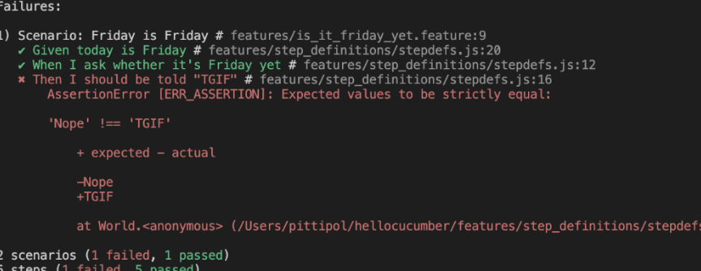
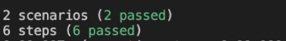
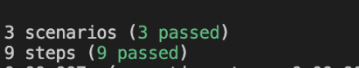

# K6

# Cucumber

เราสามารถใช้ Gherkin เพื่อเขียนสถานการณ์การใช้งานของระบบเป็นภาษาที่เข้าใจง่าย เช่น “เมื่อผู้ใช้ค้นหาศาลเจ้า ระบบจะแสดงรายละเอียดของศาลเจ้านั้น”
จากนั้นใช้ Cucumber มาช่วยทดสอบอัตโนมัติตามสถานการณ์ที่เขียนไว้ เพื่อเช็กว่าระบบทำงานถูกต้องตามที่ต้องการหรือไม่
