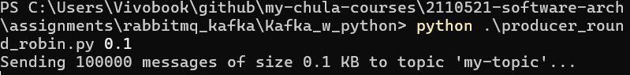
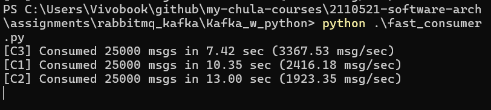
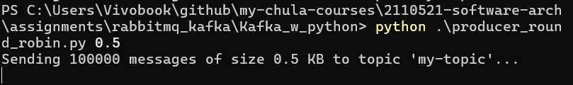
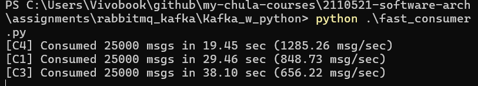
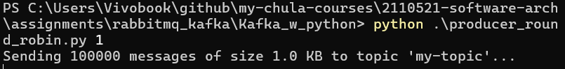
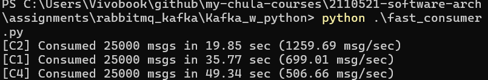
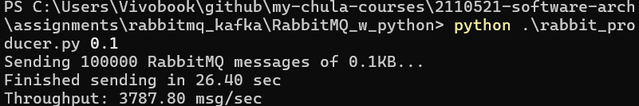
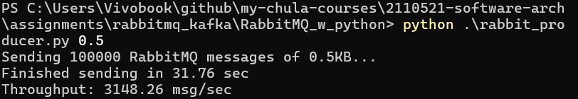
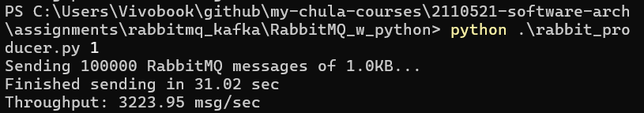

# Kafka

## Codes

### Consumer

```
import threading, time, json
from kafka import KafkaConsumer

BOOTSTRAP_SERVERS = 'localhost:9092'
TOPIC_NAME = 'my-topic'
GROUP_ID = 'test-group'
NUM_CONSUMERS = 4

def consume_in_parallel(cid):
    consumer = KafkaConsumer(
        TOPIC_NAME,
        bootstrap_servers=BOOTSTRAP_SERVERS,
        group_id=GROUP_ID,
        auto_offset_reset='earliest',
        value_deserializer=lambda v: json.loads(v.decode('utf-8'))
    )

    count = 0
    start = time.time()

    for message in consumer:
        count += 1
        if count >= 100000 // NUM_CONSUMERS:  # stop after consuming share
            break

    end = time.time()
    print(f"[{cid}] Consumed {count} msgs in {end - start:.2f} sec "
          f"({count / (end - start):.2f} msg/sec)")
    consumer.close()

if __name__ == "__main__":
    threads = []
    for i in range(NUM_CONSUMERS):
        t = threading.Thread(target=consume_in_parallel, args=(f"C{i+1}",))
        threads.append(t)
        t.start()
    for t in threads:
        t.join()
```

### Producer

```
from kafka import KafkaProducer
import json, time, sys

producer = KafkaProducer(
    bootstrap_servers=['localhost:9092'],
    value_serializer=lambda v: json.dumps(v).encode('utf-8')
)

topic_name = 'my-topic'
num_messages = 100000  # 100K messages

# Argument for message size in KB (default = 0.1KB)
msg_size_kb = float(sys.argv[1]) if len(sys.argv) > 1 else 0.1
payload = "X" * int(msg_size_kb * 1024)  # fill with dummy characters

print(f"Sending {num_messages} messages of size {msg_size_kb} KB to topic '{topic_name}'...")

start = time.time()

for i in range(num_messages):
    message = {'id': i, 'payload': payload}
    producer.send(topic_name, value=message)

producer.flush()
end = time.time()

print(f"Finished sending {num_messages} messages in {end - start:.2f} sec")
print(f"Throughput: {num_messages / (end - start):.2f} msg/sec")

producer.close()

```

## Results

### 0.1 KB





### 0.5 KB





### 1 KB





# RabbitMQ

## Codes

### Consumer

```
import pika, threading, time, json

NUM_CONSUMERS = 4

def consume(cid):
    connection = pika.BlockingConnection(pika.ConnectionParameters('localhost'))
    channel = connection.channel()
    channel.queue_declare(queue='test-queue')

    count = 0
    start = time.time()

    def callback(ch, method, properties, body):
        nonlocal count, start
        count += 1
        if count >= 100000 // NUM_CONSUMERS:
            end = time.time()
            print(f"[{cid}] Consumed {count} msgs in {end - start:.2f} sec "
                  f"({count / (end - start):.2f} msg/sec)")
            ch.stop_consuming()

    channel.basic_consume(queue='test-queue', on_message_callback=callback, auto_ack=True)
    channel.start_consuming()
    connection.close()

if __name__ == "__main__":
    threads = []
    for i in range(NUM_CONSUMERS):
        t = threading.Thread(target=consume, args=(f"C{i+1}",))
        threads.append(t)
        t.start()
    for t in threads:
        t.join()

```

### Producer

```
import pika, time, sys, json

connection = pika.BlockingConnection(pika.ConnectionParameters('localhost'))
channel = connection.channel()
channel.queue_declare(queue='test-queue')

num_messages = 100000
msg_size_kb = float(sys.argv[1]) if len(sys.argv) > 1 else 0.1
payload = "X" * int(msg_size_kb * 1024)

print(f"Sending {num_messages} RabbitMQ messages of {msg_size_kb}KB...")

start = time.time()
for i in range(num_messages):
    message = json.dumps({'id': i, 'payload': payload})
    channel.basic_publish(exchange='', routing_key='test-queue', body=message)

end = time.time()
print(f"Finished sending in {end - start:.2f} sec")
print(f"Throughput: {num_messages / (end - start):.2f} msg/sec")

connection.close()

```

## Results

### 0.1 KB



### 0.5 KB



### 1 KB


