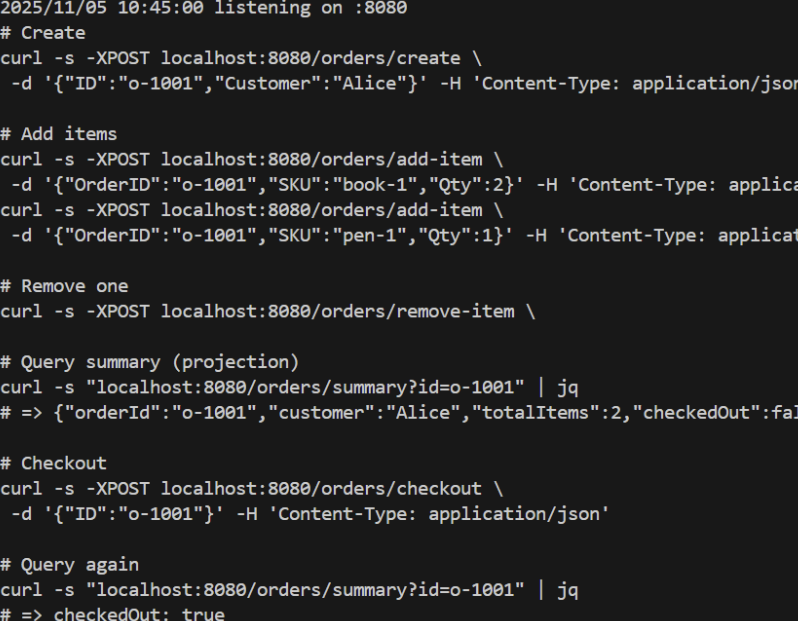
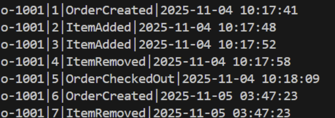

# สรุปจาก Guest Speaker: Microservice & Event Sourcing

## แนวคิดหลัก

- การออกแบบระบบแบบ Microservice ต้องคำนึงถึงความเสถียร, การตรวจสอบ, และการสเกล
- ระบบที่ดีต้อง “แยกส่วน, บันทึกเหตุการณ์, และตรวจสอบย้อนหลังได้”

---

## Health Check สำคัญมาก

- ตรวจสถานะของ service เป็นช่วง ๆ (เช่น ทุก 15 วินาที)
- ป้องกันไม่ให้ server ที่เพิ่งฟื้นตัวถูกยิง request ถล่ม
- ช่วยให้ระบบฟื้นจากความล้มเหลวได้เร็วขึ้น

---

## Logging = หลักฐานของระบบ

- Logs ใช้ตรวจสอบปัญหาและหา root cause
- ใช้เป็นหลักฐานยืนยันเวลามีข้อโต้แย้งทางเทคนิค
- ควรเก็บ log อย่างเป็นระบบและสม่ำเสมอ

---

## Kafka vs RabbitMQ

| ระบบ     | ความเร็ว | ความเสถียร                          | หมายเหตุ                         |
| -------- | -------- | ----------------------------------- | -------------------------------- |
| Kafka    | เร็ว     | ไม่ค่อยเสถียร (connection หลุดง่าย) | เหมาะกับระบบที่เน้น throughput   |
| RabbitMQ | ช้ากว่า  | เสถียรกว่า                          | เหมาะกับระบบที่ต้องการความมั่นคง |

---

## Database Bottleneck

- จุดคอขวดหลักของ microservice มักอยู่ที่ database
- การอ่าน (read) มักต้องเร็ว → ใช้ partition / indexing ช่วย
- แลกมากับการเขียน (create/update/delete) ที่ช้าลง

---

## Event Sourcing

- เก็บทุกการเปลี่ยนแปลงเป็น “เหตุการณ์ (event)” แทนการเก็บ state เดียว
- ตัวอย่าง: แทนที่จะเก็บ `x = 100` → เก็บเป็น `[+120, -50, +30]`
- ช่วยให้ระบบสามารถ “ย้อนเวลา” ดูประวัติทุกขั้นตอนของข้อมูลได้

---

## CQRS (Command Query Responsibility Segregation)

- แยกส่วน เขียน (Command) และ อ่าน (Query) ออกจากกัน
- เขียนใช้ model หนึ่ง, อ่านใช้ model หนึ่ง
- ช่วยให้ระบบสเกลได้ดี, อ่านเร็วขึ้น, และแต่ละส่วนพัฒนาแยกกันได้
- เหมาะกับระบบขนาดใหญ่ ไม่จำเป็นสำหรับ CRUD ธรรมดา

---

## ตัวอย่างระบบ E-commerce

- ฝั่ง Command: “PlaceOrder” → บันทึก event “OrderPlaced”
- ฝั่ง Query: อัปเดต read model → ใช้แสดงรายการสั่งซื้อเร็วขึ้น

---

## Two Phase Commit (2PC)

- มี 2 ขั้นตอน:
  1. Prepare: Coordinator ตรวจว่าทุก DB พร้อม commit หรือไม่
  2. Commit: ถ้าทุกฝั่งตอบรับ → commit พร้อมกันทั้งหมด
- ถ้ามี DB ใดล้ม → Coordinator สั่ง rollback ทุกฝั่ง
- ปัญหา: ระบบช้าและซับซ้อน เพราะต้องรอการ sync จากทุก DB

---

## Ordering Guarantee

- ต้องจัดการให้ event เกิดตามลำดับที่ถูกต้องเสมอ
- ถ้าเรียงผิด (เช่น checkout ก่อน add item) → ข้อมูลสุดท้ายจะผิดพลาด

---

## สรุปแนวคิดสำคัญ

- Microservice ต้อง monitor + log + isolate ให้ดี
- การใช้ Event Sourcing + CQRS ช่วยให้ระบบสเกลและตรวจสอบย้อนหลังได้
- แต่ต้องแลกกับความซับซ้อนในการพัฒนาและ debug

## In-class Activity

