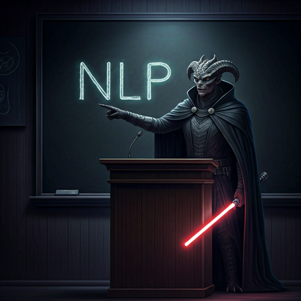

# NLP_2025 (2110572 NLP SYS @Chula)

### Based on [Ekapolc's NLP-SYS Github repository](https://github.com/ekapolc/NLP_2025)

The course will give an overview of the Natural Language Processing techniques in the transition period between traditional techniques and deep learning. The course will touch upon various standard NLP tasks, such as tokenization, language modeling, semantics, and part-of-speech tagging. The second part of the course will go into LLMs in depth. Many of the assignments will be in the context of Thai language. This course is not meant to be an entry-level machine learning course, and will not cover the basics of machine learning. This course is recommended for graudated students, 4th year students who have already taken some machine learning course, and 3rd year students who are interested in doing senior projects related to NLP. Knowledge of pytorch is required.

# Course Syllabus

[Here](https://docs.google.com/document/d/1MOhzLCb1vQvqUfPrlPkFPehTqA-ptvRL/edit?usp=sharing&ouid=117491583517041967973&rtpof=true&sd=true)
